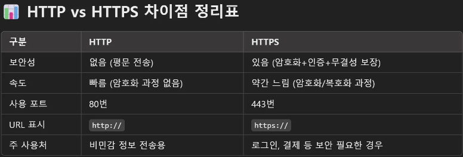

# 📖HTTP란?

## ✅HyperText Transfer Protocol

웹에서 데이터를 주고 받는 표준 프로토콜(규약)

## ✅HTTP 기반 통신

클라이언트와  서버가 정보를 주고 받을 때, HTTP 프로토콜을 기반으로

요청(Request)와 응답(Response)을 통해서 주고 받는 방식

### ➡️요청

HTTP 메소드, 요청 URL, Header, Body(데이터)

### ⬅️응답

상태코드(200, 404 등), Header, Body(데이터)

## ✅HTTP 기반 통신의 필요성

1. 범용성 : 전 세계 웹 서비스 사용의 표준
2. 쉬운 사용 : 요청과 응답 규격이 단순, 거의 모든 언어에서 지원

### 🤔http와 https의 차이

### ☑️https 인증서를 받는 조건

1. 자신이 소유한 도메인이 있어야함
2. 도메인이 자신의 소유라는 것을 인증기관을 통해 검사
3. 인증서를 설치할 서버 필요

### ☑️https만 있으면 안전한가?

HTTP 통신

- 데이터를 그냥 평문으로 보냄
- 중간에 데이터 가로챌 위험 있음

HTTPS 통신

- 데이터를 보내기 전에 암호화하여 전송
- 중간에 가로채더라도 암호화된 데이터
- 서버에서만 해독 가능 (서버에 설치된 인증서 + 키)

HTTPS 는 데이터의 전송 구간만 보호

서버 내부 보안, 데이터베이스 보안 등은 별도 관리가 필요

## 💡“HTTPS는 최소한의 보안 장치”