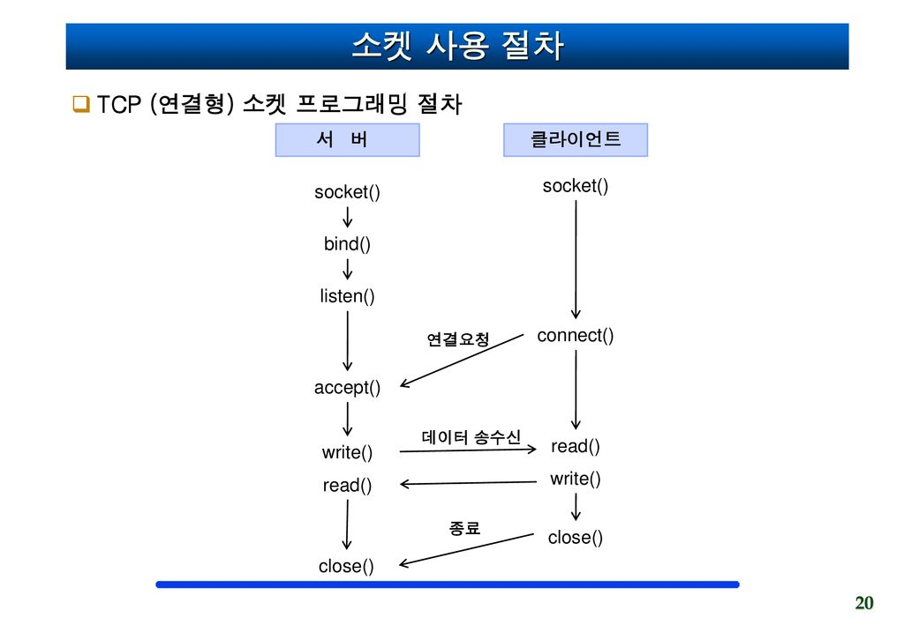

## tcp_echocli.c

```c
#include "netprog.h"
#define MAXLINE 127

int main(int argc, char *argv[]){
	struct sockaddr_in servaddr;
	int s, nbyte;
	char buf[MAXLINE+1];
	
	if(argc != 3){
		printf("usage : %s ip_address port_number\n", argv[0]);
		exit(0);
	}
	//PF_INET : IPv4 통신을 함, SOCK_STREAM : TCP 통신을 함
	if((s = socket(PF_INET, SOCK_STREAM, 0)) < 0)
		errquit("socket fail");
	
	//bzero : 구조체의 내용을 모두 0으로 세트
	bzero((char*)&servaddr, sizeof(servaddr));
	//sin_family = AF_INET : 주소 체계 설정(Ipv4 의미)
	servaddr.sin_family = AF_INET;
	//inet_pton : AF_INET 방식으로 첫 번째 인자를 읽음. 
	// 이를 네트워크용 이진 포맷으로 servaddr.sin_addr에 저장
	inet_pton(AF_INET, argv[1], &servaddr.sin_addr);
	//atoi : 문자열로 저장된 숫자를 정수로 변환
	//htons : host to network short (네트워크 바이트 순서 표준인 빅 엔디안으로 변환)
	servaddr.sin_port = htons(atoi(argv[2]));
	
	//(struct sockaddr*)&servaddr 과 같이 sockaddr 타입으로 캐스팅이 필요
	if(connect(s, (struct sockaddr*)&servaddr, sizeof(servaddr))<0)
			errquit("connect fail");
	
	printf("입력 : ");
	//fgets : buf에 buf 크기만큼 표준 입력(키보드)으로 문자열 받음
	if(fgets(buf, sizeof(buf), stdin) == NULL)
		errquit("fgets 실패\n");
		
	//strlen : null 문자 빼고 길이 계산
	nbyte = strlen(buf);
	//소켓 s로 buf 내용을 nbyte 길이만큼 쓰기
	if(write(s, buf, nbyte) < 0)
		errquit("write fail");
				
	printf("수신 : ");
	//소켓 s를 통해서 buf로 MALINE 길이까지 읽어옴(길이는 nbyte에 저장)
	if((nbyte = read(s, buf, MAXLINE))<0)
			errquit("read fail");
	
	//null 문자 추가 및 출력
	buf[nbyte] = 0;
	printf("%s", buf);
			
	close(s);
			
	return 0;
}
```

## tcp_echoserv.c

```c
#include "netprog.h"
#define MAXLINE 127

int main(int argc, char *argv[]){
    struct sockaddr_in servaddr, cliaddr;
    int listen_sock, accp_sock, nbyte, addrlen = sizeof(cliaddr);
    char buf[MAXLINE+1];

    if(argc != 2){
        printf("usage : %s port\n", argv[0]);
        exit(0);
    }
		//listen_sock : 클라이언트를 수동 대기할 소켓
    if((listen_sock = socket(PF_INET, SOCK_STREAM, 0)) < 0)
        errquit("socket fail");
		
    bzero((char*)&servaddr, sizeof(servaddr));
    servaddr.sin_family = AF_INET;
    //INADDR_ANY : 127.0.0.1 = localhost
    servaddr.sin_addr.s_addr = htonl(INADDR_ANY);
    servaddr.sin_port = htons(atoi(argv[1]));
	
		//bind : listen_sock 소켓 번호와 소켓 주소(IP 주소 + 포트번호) 연결
    if(bind(listen_sock, (struct sockaddr*)&servaddr, sizeof(servaddr)) < 0)
        errquit("bind fail");
		
		//5개까지 연결 가능
    listen(listen_sock, 5);
		
		//수동 대기
    while(1){
        puts("서버가 연결요청을 기다리는 중...");
        //비어있던 cliaddr 구조체에 accept 함수로 인해서 구조체 내용이 채워짐
        //★주소를 받기 때문에 addrlen의 포인터로 받음 cliaddr 구조체 크기의 포인터)
        accp_sock = accept(listen_sock, (struct sockaddr*)&cliaddr, &addrlen);

        if(accp_sock < 0)
            errquit("accept fail");

        puts("클라이언트가 연결 됨...");
				//accp_sock을 통해서 buf로 MAXLINE까지 읽어옴(길이는 nbyte에 저장)
        nbyte = read(accp_sock, buf, MAXLINE);
        //accp_sock으로 읽은 buf 내용을 nbyte만큼 전송
        write(accp_sock, buf, nbyte);

        close(accp_sock);
    }
    close(listen_sock);
}

```

## Makefile

```c
//make 명령어는 현재 디렉터리의 Makefile을 읽고, 첫 번째 규칙(all)을 읽고 수행
//C Compiler = gcc
CC = gcc
TARGETS = tcp_echoserv tcp_echocli
all: $(TARGETS)
//tcp_echoserv.c 또는 netprog.h 변경시 다음 명령어로 재컴파일
tcp_echoserv: tcp_echoserv.c netprog.h
        $(CC) -o tcp_echoserv tcp_echoserv.c
//tcp_echocli.c 또는 netprog.h 변경시 다음 명령어로 재컴파일
tcp_echocli: tcp_echocli.c netprog.h
        $(CC) -o tcp_echocli tcp_echocli.c
//빌드된 결과물 삭제
clean:
        rm -f $(TARGETS)
```