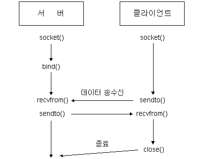

## udp_echocli.c

```c
#include "netprog.h"
#define MAXLINE 511

int main(int argc, char *argv[]) {
    struct sockaddr_in servaddr;
    int s, nbyte, addrlen = sizeof(servaddr);
    char buf[MAXLINE+1];

    if(argc != 3) {
        printf("usage : %s ip_address port_number\n", argv[0]);
        exit(0);
    }
    //★ SOCK_DGRAM
    if((s = socket(PF_INET, SOCK_DGRAM, 0)) < 0) {
        errquit("socket fail");
    }

    bzero((char *)&servaddr, sizeof(servaddr));
    servaddr.sin_family = AF_INET;
    inet_pton(AF_INET, argv[1], &servaddr.sin_addr);
    servaddr.sin_port = htons(atoi(argv[2]));
    
    printf("입력 : ");
    if(fgets(buf, sizeof(buf), stdin) == NULL){
        errquit("fgets 실패");
    }
		//sendto 할 때 port번호가 결정됨
		//s 소켓을 사용하여 buf 내용을 buf길이만큼 servaddr 구조체 내용으로 전송
    if(sendto(s, buf, strlen(buf), 0, (struct sockaddr*)&servaddr, sizeof(servaddr)) < 0 ){
        errquit("sendto fail");
    }
		
		//s 소켓을 통해서 buf로 MAXLINE 길이만큼 servaddr 구조체로부터 받음 ★&addrlen 주의
    if((nbyte = recvfrom(s, buf, MAXLINE, 0, (struct sockaddr*)&servaddr, &addrlen)) < 0 ) {
        errquit("recvfrom fail");
    }
    //null문자 추가 및 출력
    buf[nbyte] = 0;
    printf("수신 : %s", buf);
    close(s);
}

```

## udp_echoserv.c

```c
#include "netprog.h"
#define MAXLINE 511

int main(int argc, char*argv[]) {
		struct sockaddr_in servaddr, cliaddr;
    int s, nbyte, addrlen = sizeof(cliaddr);
    char buf[MAXLINE+1];

    if(argc !=2) {
            printf("usage : %s port\n", argv[0]);
            exit(0);
    }
    if((s = socket(PF_INET, SOCK_DGRAM, 0)) < 0 )
            errquit("socket fail");

    bzero((char *)&servaddr, sizeof(servaddr));
    servaddr.sin_family = AF_INET;
    servaddr.sin_addr.s_addr = htonl(INADDR_ANY);
    servaddr.sin_port = htons(atoi(argv[1]));
    
		//bind를 통한 소켓 디스크립터와 실제 구조체 연결
    if(bind(s, (struct sockaddr*)&servaddr, sizeof(servaddr)) < 0)
            errquit("bind fail");

    while(1) {
        puts("Server : waiting request.");
        
        //s 소켓을 통해서 buf로 MAXLINE 길이만큼 cliaddr 구조체로부터 받음 ★&addrlen 주의
        // 받는 순간에 cliaddr 구조체에 내용 저장 따라서 아래에서 sendto, 가능
        nbyte = recvfrom(s, buf, MAXLINE, 0, (struct sockaddr*)&cliaddr, &addrlen);
        if(nbyte < 0)
              errquit("recvfrom fail");
        //null 문자 추가, 출력
        buf[nbyte] = 0;
        printf("%d byte recvd : %s\n", nbyte, buf);
				
				//s 소켓을 사용하여 buf 내용을 nbyte 길이만큼 cliaddr 구조체로 보냄
        if(sendto(s, buf, nbyte, 0, (struct sockaddr*)&cliaddr, addrlen) < 0)
                errquit("sendto fail");
        puts("sendto complete");
    }
}

```

## Makefile

```c
CC = gcc
TARGETS = udp_echoserv udp_echocli
all : $(TARGETS)
udp_echoserv: udp_echoserv.c netprog.h
		$(CC) -o udp_echoserv udp_echoserv.c
udp_echocli: udp_echocli.c netprog.h
		$(CC) -o udp_echocli udp_echocli.c
clean:
		rm -f $(TARGETS)
```