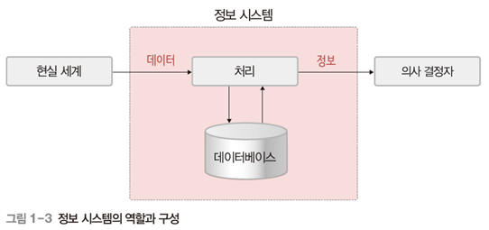
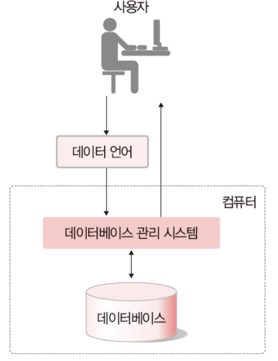
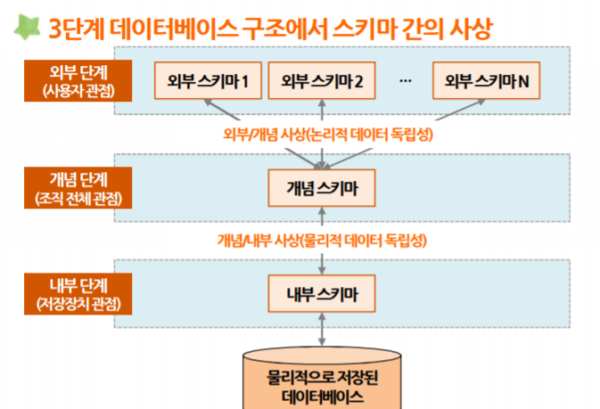
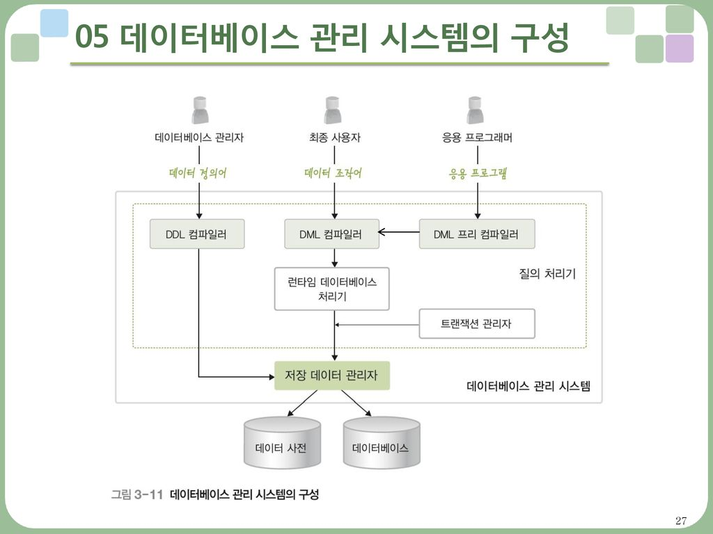
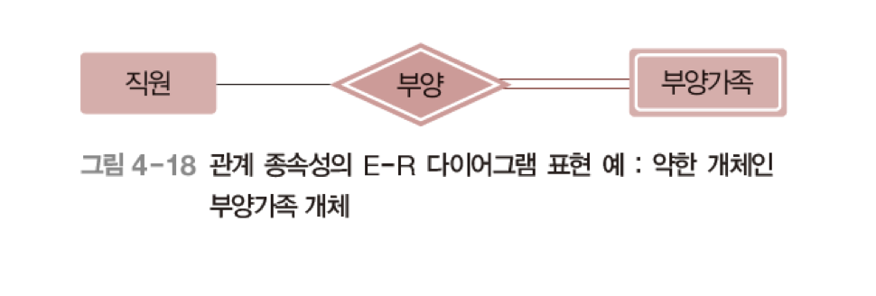
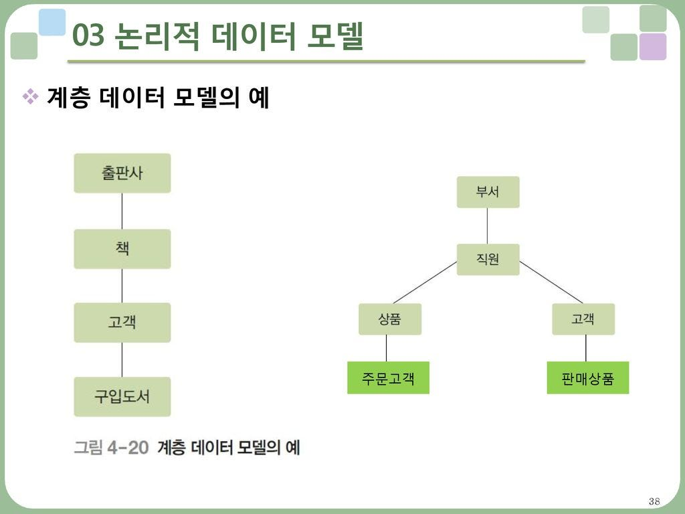
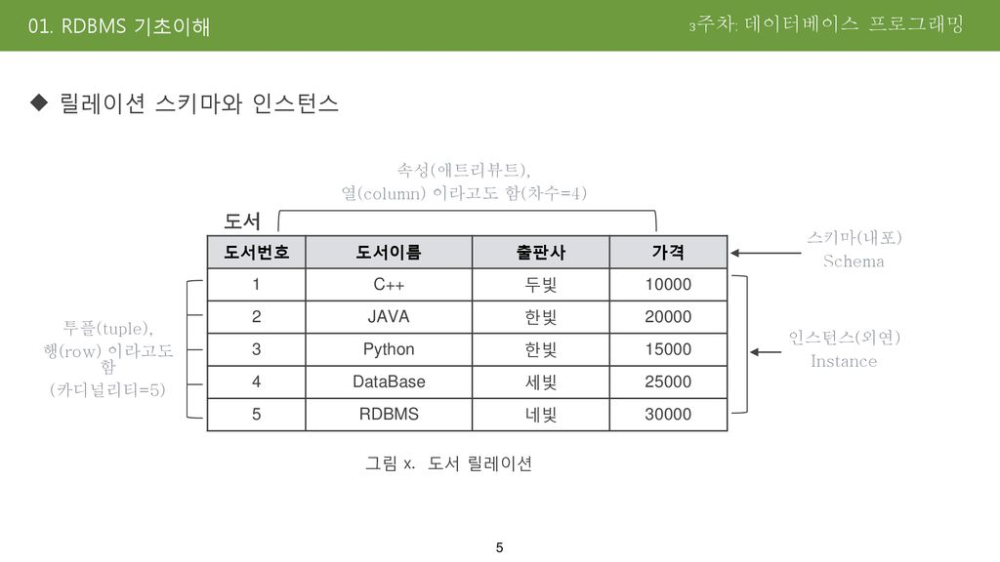
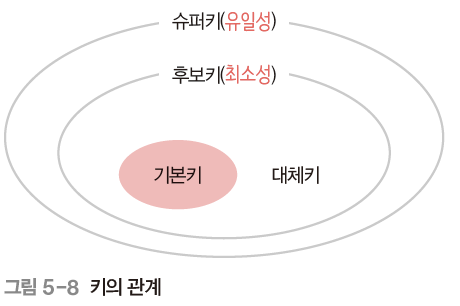

# 1장 DB 기본 개념

## ➡️데이터와 정보

데이터 : 현실 세계에서 단순히 관찰하거나 측정하여 수집한 사실이나 값

정보 : 데이터를 의사 결정에 유용하게 활용할 수 있도록 **처리한 결과물**

정보 처리 : 데이터에서 정보를 추출하는 과정 또는 방법

- 정확성
- 현재성
- 활용성

등의 특징을 필요로 함

## ➡️데이터베이스란?

- 정의

특정 조직의 여러 사용자가 **공유**하여 사용할 수 있도록 **통합 저장한 운영 데이터**의 집합

공유 데이터 : 여러 사용자의 활용

통합 데이터 : 중복 최소화

저장 데이터 : 컴퓨터가 접근 가능

운영 데이터 : 조직의 주요 기능 수행

- 특징
1. 실시간 접근
2. 계속 변화(동적 특징)
3. 동시 공유
4. 값을 통한 참조

## ➡️데이터 분류

### 형태에 따른 데이터 분류

1. 정형 데이터 : 구조화된 데이터(엑셀, RDBMS 테이블 등)
2. 반정형 데이터 : 데이터 내용에 구조가 담긴 데이터(Json, XML 등)
3. 비정형 데이터 : 구조가 없는 데이터(텍스트, 영상, 말 등)

### 특성에 따른 데이터 분류

- 범주형 데이터 : 범주로 구분할 수 있는 값
1. 명목형 데이터 : 서열이 없는 값(성별, 혈액형, 학과명 등)
2. 순서형 데이터 : 서열이 있는 값(학년, 학점, 회원등급 등)
- 수치형 데이터 : 양적 측면에서 크기 비교, 산술 연산이 가능한 값
1. 이산형 데이터 : 정수형 값(고객 수, 판매량 등)
2. 연속형 데이터 : 실수형 값(키, 몸무게, 온도 등)

# 2장 DBMS

## ➡️파일 시스템의 문제점

1. 데이터 중복성 문제(일관성, 무결성을 유지하지 못 함)
2. 데이터 종속성 문제(응용 프로그램이 데이터베이스를 사용할 때, 파일에 종속적)
3. 데이터 동시 공유, 보안, 회복 문제
4. 응용프로그램 개발 문제(파일을 데이터베이스로 사용하는 프로그램을 요구에 맞춰 개발해야함)

## ➡️DBMS의 등장

파일 시스템의 중복 문제, 데이터 종속 문제를 해결하기 위한 소프트웨어(사진은 3tier model)

사용자나 응용프로그램은 DB의 물리적 저장 구조나, 데이터 접근 및 처리 방법을 알 필요 없어짐
또한 DB 구조나 접근 방법이 변경되어도 응용 프로그램을 변경할 필요가 없어서 **데이터 독립성 확보**

### ⭐주요 기능⭐

- 정의 기능 : 데이터베이스 구조 정의, 수정
- 조작 기능 : 데이터 삽입, 삭제, 수정, 검색 연산
- 제어 기능 : 데이터 정확성, 안정성 유지(동시 공유 가능, 일관성 및 무결성 유지, 보안 및 회복 가능)

### ✅ DBMS의 장점

1. 데이터 중복 통제 (파일 시스템은 응용 프로그램마다 별도의 파일 유지, 같은 데이터 중복 저장함)
2. 데이터 독립성 확보 (파일 시스템은 파일 구조 바뀌면 응용 프로그램 수정해야함)
3. 데이터 동시 공유 (파일 시스템은 동시 공유가 일반적으로 안 됨)
4. 데이터 보안 향상 (파일 시스템은 모든 파일의 보안을 같은 수준으로 유지하기 어려움)
5. 데이터 무결성 유지 (파일 시스템과 다르게 연산 수행시 데이터 유효성 검사를 통해 무결성 유지)
6. 표준화, 장애 발생시 회복, 응용 프로그램 개발 비용 줄어듦 등의 장점

### ☑️ DBMS의 단점

1. 높은 비용 (컴퓨터 자원을 많이 사용)
2. 중앙 집중 관리로 취약점 존재 (DBMS에 장애 발생시 전체 시스템 업무 중단)
3. ~~백업과 회복 방법 복잡 (과거 이야기)~~

# 3장 DB System

## ➡️DB, DBMS, DBS의 차이점

DataBase : 데이터를 저장해 두는 곳

DataBaseManagementSystem : DB에 저장된 데이터의 일관성, 무결성 유지하도록 관리

DataBaseSystem : DB와 DBMS를 이용해 필요한 정보를 제공해주는 전체 시스템(사진 전체를 의미)

## ➡️데이터베이스의 구조

- 스키마(테이블) : 데이터 구조와 제약 조건을 정의한 것
- ⭐3단계 데이터베이스 구조⭐
1. 외부 단계(개별 사용자에게 필요한 DB 정의, 외부 스키마)
2. 개념 단계(조직 전체의 관점에서, 모든 사용자에게 필요한 DB를 통합하여 정의, 개념 스키마)

   (일반적인 스키마=개념 스키마)

3. 내부 단계(저장 장치에 저장되는 방법을 정의, 내부 스키마)

   (DB에 하나만 존재하는 스키마)

- **데이터베이스 독립성을 위해서** 3단계 데이터베이스 구조 적용
1. 논리적 데이터 독립성 : 개념스키마가 변경되더라도 외부 스키마가 영향을 받지 않는 것

   (외부/개념 사상 정보만 적절히 수정해주면 됨)

   ex) 컬럼명 변경

2. 물리적 데이터 독립성 : 내부 스키마가 변경되더라도 개념 스키마가 영향을 받지 않는 것

   (개념/내부 사상 정보만 적절히 수정해주면 됨, 결과적으로 외부 스키마도 영향을 받지 않음)

   ex) 컬럼 위치, 순서 변경

- 데이터 사전(시스템 카탈로그) : 데이터에 관한 정보를 저장(메타 데이터 저장)

## ➡️데이터베이스 사용자

1. 데이터베이스 관리자 : 데이터 정의어(DDL), 데이터 제어어(DCL) 이용해 DB 접근
- DB 구성 요소 선정, 스키마 정의, 물리적 저장 구조 및 접근 방법 결정, 무결성 유지를 위한 제약조건 정의
- 보안 및 접근 권한 정책 결정, 백업 및 회복 기법 정의, 시스템 데이터베이스 관리(데이터 사전)
- 성능 감시 및 분석
1. 최종 사용자(end user) : 주로 데이터 조작어(DML) 이용해 DB 접근
- 응용 프로그래머가 작성한 응용 프로그램을 통해 DB에 접근
1. 응용 프로그래머 : 주로 데이터 조작어(DML)를 삽입, end user가 사용할 수 있도록 함

## ➡️데이터 언어

1. 데이터 정의어(Data Definition Language) : 스키마 정의, 삭제, 수정(데이터 사전에 저장됨)
2. 데이터 조작어(Data Manipulation Language) : 데이터 삽입, 삭제, 수정, 검색 연산
- 절차적 데이터 조작어 : 어떤 데이터인지, 어떻게 처리해야하는지 설명
- 비절차적 데이터 조작어 : 어떤 데이터인지만 설명(선언적 언어)
1. 데이터 제어어(Data Control Language) : 내부적으로 필요한 규칙, 기법 정의
- **데이터를 여러 사용자가 무결성과 일관성을 유지하며, 보안을 통해 동시에 공유할 수 있도록 사용**

## ➡️DBMS의 구성(살펴보기)

사용자와 DB 사이에 위치하며 기능에 따라 **질의 처리기**와 **저장 데이터 관리자**로 구분

- 질의 처리기
1. DDL 컴파일러 : 데이터 정의어로 작성된 스키마의 정의를 해석(데이터베이스, 데이터 사전 구축)
2. DML 프리 컴파일러 : 응용 프로그램의 데이터 조작어를 추출하여 DML 컴파일러로 전달
3. DML 컴파일러 : 데이터 조작어 처리 및 해석
4. 런타임 데이터베이스 처리기 : DML 컴파일러로 받은 데이터 처리요구를 실제 DB에 실행
5. 트랜잭션 관리자 : DB 접근 권한, 무결성 유지를 위한 제약조건 위반 여부 확인
- 저장 데이터 관리자 : DB와 데이터 사전 관리, 실제로 접근을 담당

# 4장 데이터 모델링

## ✅개체-관계 모델(ERDiagram)

### 1️⃣ 개체(Entity)

의미 : 저장할 만한 가치가 있는 중요 데이터를 가진 사람 또는 사물

특징 : 각 개체만의 고유한 특성이나 상태, 즉 속서을 하나 이상 가지고 있다.

- 개체 인스턴스 : 속성이 실제 값을 가져 실체화된 개체
- 개체 집합 : 개체 인스턴스의 모음

### 2️⃣ 속성(Attribute)

의미 : 개체가 가지고 있는 고유한 특성

특징 : 일반적으로 의미 있는 데이터의 가장 작은 논리적 단위

- 속성 값의 개수
1. 단일 값 속성 : 단 하나의 값만 가질 때 (ex 이름, 적립금 등)
2. 다중 값 속성 : 여러 개의 값을 가질 때 (ex 연락처, 저자 등)
- 의미의 분해 가능성
1. 단순 속성 : 의미를 더는 분해할 수 없는 속성 (ex 이름, 가격 등)
2. 복합 속성 : 의미를 분해할 수 있어 값이 여러 개의 의미를 포함 (ex 생년월일, 지역명)
- 유도 속성 : 다른 속성 값에서 유도되어 결정되는 속성, 굳이 저장할 필요x (ex 가격+할인율→판매가격)
- 널 속성 : 아직 결정되지 않은 값 (공백, 0과는 다름)
- **키 속성** : 개체 집합에 존재하는 각 개체 인스턴스들을 식별하는데 사용 (유일성 보장)

### 3️⃣ 관계(Relationship)

의미 : 개체 집합들 사이의 대응 관계, 매핑을 의미.

- 관계 인스턴스 : 개체 인스턴스 간의 관계

📙관계에 참여하는 개체 타입 수

1. 이항 관계
2. 삼항 관계
3. 순환 관계

📘매핑 카디널리티

의미 : 매핑 원소의 수에 따른 분류 (각 개체 인스턴스가 연관성을 맺고 있는 상대 게체 집합의 인스턴스 개수)

- 일대일 관계 : ex)남편1-1아내 (하나의 남편에 하나의 아내)
- 일대다 관계 : ex)부서1-n사원 (하나의 부서에 여러 사원)
- 다대다 관계 : ex)고객n-m책 (여러 고객이 여러 책 구매)

📗관계의 특징

- 관계의 참여 특성 : 필수적 참여 관계는 이중선으로 표현한다.( ex 고객이 책을 반드시 구매하면 고객=구매-책)
- **관계의 종속성** : 한 개체가 다른 개체의 존재 여부에 의존적인 경우. 일반적으로 일대다 관계에서 형성됨

  (ex 회사 입장에서 부양가족 개체는 직원 개체에 의존적. 부양가족 개체(약한 개체), 직원 개체(강한 개체))

  또한 약한 개체는 강한 개체의 기본키를 가져와 (강한 개체의 기본키 + 약한 개체의 부분키)를 기본키로 사용한다.

### 4️⃣ E-R 다이어그램

개체-관계 모델을 이용해 현실 세계를 개념적으로 모델링한 결과물

- 장점
    1. 데이터 구조를 시각적으로 표현
    2. 개발 전 설계 품질 향상
    3. 협업시 의사소통 수단
    4. DB 구현 가이드 제공
    5. 유지보수 및 확장에 유리

## ✅논리적 데이터 모델

### ➡️ 논리적 데이터 모델의 개념과 특성

개념 : E-R다이어그램으로 표현된 개념적 구조를 데이터베이스에 어떤 형태로 저장할지를 논리적으로 표현

- 관계 데이터 모델 : 논리적 구조가 2차원 테이블 형태 (일반적으로 많이 사용

### ➡️계층 데이터 모델(참고만 하기)

- 특징
    1. 루트 개체 존재
    2. 사이클 없음
    3. 트리 형태이므로 부모 자식 개체 존재
    4. 다대다 관계 직접 표현 불가(별도의 개체를 자식 개체로 추가 생성)

# 5장 관계 데이터 모델

## ✅관계 데이터 모델의 개념

### ➡️관계 데이터 모델의 기본 용어

- 속성 : 릴레이션의 열(필드)
- 투플 : 릴레이션의 행(레코드, 개체의 인스턴스)
- 도메인 : 속성 하나가 가질 수 있는 모든 원자값의 집합을 해당 속성의 도메인이라고 함.(ex 등급 vip, gold silver ..)
- 널 값 : 아직 결정되지 않았거나 모르는 값 (0이나 공백 문자와는 다름)
- 차수 : 하나의 릴레이션에서 속성 전체 개수. (정적인 특징, 모든 릴레이션은 최소 1이상의 차수)
- 카디널리티 : 하나의 릴레이션에서 투플의 전체 개수. (동적인 특징, 투플이 없을 수도 있고 자주 변함)

### ➡️릴레이션과 데이터베이스의 구성

- 릴레이션 스키마 : 릴레이션의 이름, 포함된 모든 속성의 이름으로 정의하는 논리적 구조
- 릴레이션 인스턴스 :  어느 한 시점에 릴레이션에 존재하는 투플들의 집합

- 데이터베이스 스키마와 데이터베이스 인스턴스

### ➡️릴레이션의 특성

1. 투플의 유일성 : 하나의 릴레이션에는 동일한 투플이 존재할 수 없다. (한 집합에 같은 원소가 있을 수 없음)
2. 투플의 무순서 : 하나의 릴레이션에서 투플 사이의 순서는 무의미하다. (한 집합에 원소의 순서는 무의미)
3. 속성의 무순서 : 하나의 릴레이션에서 속성 사이의 순서는 무의미하다.
4. 속성의 원자성 : 속성 값으로 원자 값만 사용할 수 있다. (다중값 속성을 허용하지 않는다)

### ➡️키의 종류

- 슈퍼키 : 유일성의 특성을 만족하는 속성(투플마다 값이 달라야함. ex고객아이디, (고객아이디, 고객명) 등)
- 후보키 : 유일성과 최소성의 특성을 모두 만족하는 속성 또는 속성들의 집합(꼭 필요한 속성들로만 키 구성. ex고객 아이디)
- 기본키 : 여러 후보키 중 기본적으로 사용할 하나의 키
    1. 널 값을 가질 수 있는 속성이 포함된 후보키는 기본키로 부적합
    2. 값이 자주 변경될 수 있는 속성이 포함된 후보키는 기본키로 부적합
    3. **단순한 후보키를 기본키로 선택**
- 대체키 : 기본키로 선택되지 못 한 후보키들

- 외래키 : 다른 릴레이션의 기본키를 참조하는 키 (널 값 가능(자신의 릴레이션 참조), 서로 다른 투플이 같은 값 가능)

## ✅관계 데이터 모델의 제약(무결성 제약 조건)

⭐무결성(integrity) : 데이터에 결함이 없는 상태, 즉 데이터가 정확하고 유효하게 유지된 상태

⭐일관성 (consistency) : 데이터가 시스템 내 규칙과 제약을 만족하는 상태

목적 : 무결성 보장, 일관성 유지

의미 : 어느 시점에 DB에 저장된 데이터를 의미하는 DB상태 또는 DB 인스턴스가 항상 지켜야 하는 중요한 규칙

### ➡️개체 무결성 제약 조건

기본키를 구성하는 모든 속성은 널 값을 가지면 안 된다는 규칙

→ 투플의 유일성 판단 불가 (기본키의 목적 상실)

### ➡️참조 무결성 제약 조건

외래키는 참조할 수 없는 값을 가질 수 없다는 규칙(널 값은 가질 수 있음!!)

→ 참조할 수 없는 값(존재하지 않는 값)을 참조하는 것은 현실 세계를 올바르게 반영하지 않은 것