# 9장 정규화

상위 항목: 🟣데이터베이스 (https://www.notion.so/1a2be780857480688d5bccc0c23e1003?pvs=21)
생성 일시: 2025년 6월 21일 오전 11:54
진행도: 개인 공부 중

# 📌정규화와 이상현상

## ✅ 정규화란

불필요한 데이터 중복이 발생하여 릴레이션에 대한 데이터의 연산을 수행할 때 부작용이 발생할 수 있다. 이러한 부작용을 이상 현상이라고 함

이상 현상을 제거하면서 데이터베이스를 올바르게 설계해나가는 과정을 정규화라고 함

## ✅ 이상 현상의 종류

### 1️⃣ 삽입 이상

릴레이션에 새 데이터를 삽입하기 위해 원치 않는 불필요한 데이터도 함께 삽입해야하는 문제

### 2️⃣ 갱신 이상

중복된 투플들 중 일부만 수정하여 데이터가 불일치하게 되는 모순 문제

### 3️⃣ 삭제 이상

꼭 필요한 데이터까지 함께 삭제하여 데이터가 손실되는 연쇄 삭제 문제

> 정규화는 이상 현상이 발생하지 않도록 관련 속성들끼리만 구성하여 릴레이션을 분해하는 과정. 정규화 과정에서 속성들 간의 함수 종속성 관계를 고려하여 함수적 종속성이 하나 존재하도록 릴레이션을 분해한다.
>

# 📌함수 종속

> 어느 시점에든 릴레이션 내의 모든 투플에서 X 값에 대한 Y 값이 항상 하나면 “X가 Y를 함수적으로 결정한다” 또는 “Y가 X에 함수적으로 종속되어 있다”라고 함. 이 경우에 X를 결정자 Y를 종속자라고 함
>

함수 종속 다이어그램

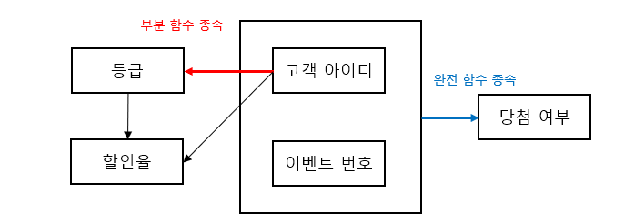

<aside>

등급 속성은 기본키인 {고객아이디, 이벤트 번호}에 종속되어 있지만, 기본키의 일부분인 고객 아이디에도 종속되어 있음. 이런 경우를 “등급 속성이 기본키에 부분 함수 종속”이라고 부름

반면, 당첨 여부 속성은 기본키에 완전 함수 종속되어 있고(부분적으로 종속된 곳이 없음), 일반적으로 함수 종속이라고 하면 이러한 완전 함수 종속을 의미

</aside>

# 📌기본 정규형과 정규화 과정

### ✅정규화

함수 종속성을 이용해 릴레이션을 연관성 있는 속성들로만 구성되도록 분해하여, 이상 현상이 발생하지 않는 올바른 릴레이션으로 만들어나가는 과정

목표 : 관련 없는 함수 종속성을 별개의 릴레이션으로 표현

### ✅ 제 1 정규형 : First Normal Form

> 릴레이션에 속한 모든 속성의 도메인이 원자 값으로만 구성되어 있으면 제1정규형 만족
>

<aside>

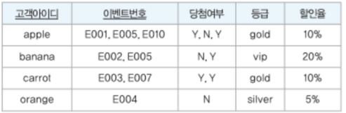

다중 값을 가지는 속성을 포함하면 제1정규형을 만족하지 못 함

투플마다 속성 값을 하나만 포함하도록 분해해야 함

</aside>

> 제1정규형을 만족해도 발생할 수 있는 이상 현상
>

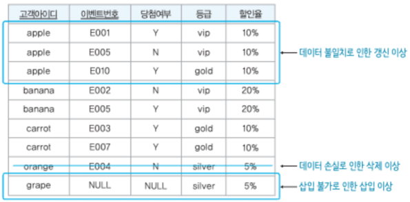

- 삽입 이상 : 이벤트에 참여하지 않는 고객은 삽입 불가(기본키를 구성하는 속성은 NULL값을 가질 수 없는 개체 무결성 제약조건 위반)
- 갱신 이상 : 중복 투플 중 일부만 수정되면 데이터 일관성을 유지할 수 없음
- 삭제 이상 : 이벤트와 관련이 없는 고객 관련 필요한 데이터도 함께 삭제됨

<aside>
💡

위 릴레이션이 부분 함수 종속을 포함하기 때문에 위와 같은 이상 현상이 발생

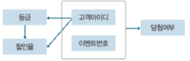

</aside>

### ✅ 제 2 정규형 : Second Normal Form

> 제1정규형에 속하며, 기본키가 아닌 모든 속성이 기본키에 완전 함수 종속되어 있으면 제2정규형 만족
>

<aside>

부분 함수 종속을 모두 제거하고, 모든 속성이 기본키에 완전 함수 종속되도록 릴레이션을 분해하는 정규화 과정을 거쳐야 함

분해된 릴레이션들은 자연 조인하여 분해 전의 릴레이션으로 다시 복원될 수 있어야함(무손실 분해)

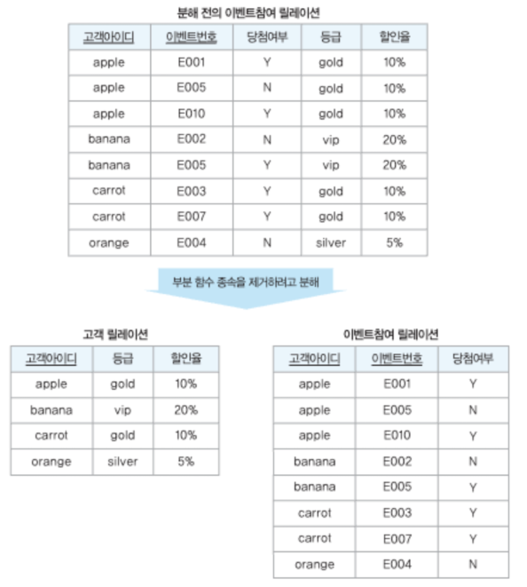

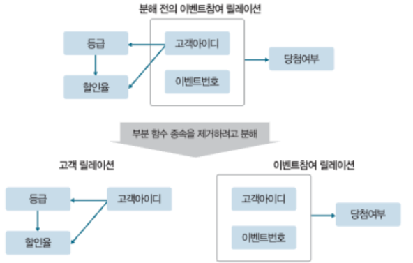

</aside>

> 제2정규형을 만족해도 발생할 수 있는 이상 현상
>

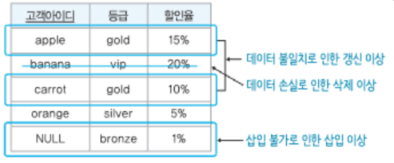

- 삽입 이상 : 해당 등급에 속하는 고객이 없으면 삽입 불가(개체 무결성 제약 조건 위반)
- 갱신 이상 : 등급에 대한 여러 할인율이 존재하는 모순 발생 (데이터 일관성 문제)
- 삭제 이상 : 고객 탈퇴로 인해 투플 삭제시 등급과 할인율에 대한 정보도 삭제

<aside>
💡

부분 함수 종속은 해소했지만, 분해한 테이블 중 고객 릴레이션에 함수 종속성을 여러개 포함해서 이상 현상이 발생(이행적 함수 종속 때문)

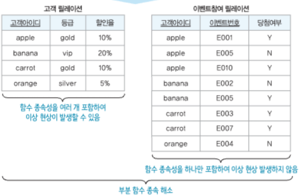

</aside>

### ✅ 제 3 정규형 : Third Normal Form

> 제2정규형에 속하며, 기본키가 아닌 모든 속성이 기본키에 이행적 함수 종속이 되지 않으면 제3정규형 만족
>

<aside>

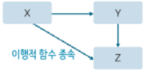

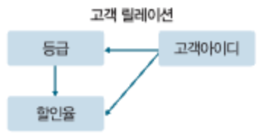

X→Y와 Y→Z가 존재하면 X→Z가 성립

이때 속성 집합 Z가 속성 집합 X에 이행적으로 함수 종속되었다고 함

위의 고객 릴레이션에서 할인율은 고객아이디에 이행적 함수 종속되어 있음

이런 이행적 함수 종속이 되지 않도록 릴레이션을 분해해야 제3정규형을 만족

</aside>

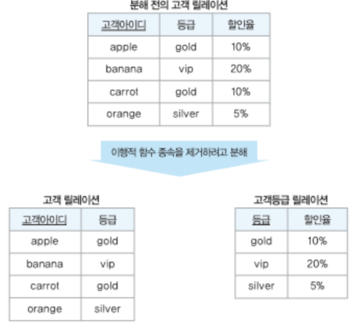

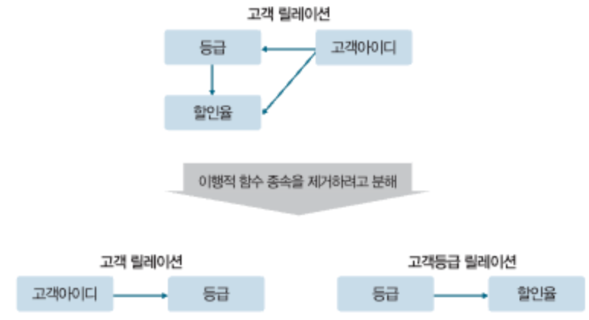

<aside>
💡

분해된 두 테이블 모두 제3정규형을 만족

**제3정규형을 만족해도 이상 현상이 발생할 수도 있음(아래 BCNF참고**)

</aside>

### ✅ 보이스/코드 정규형 : Boyce/Codd Normal Form(BCNF)

> 릴레이션의 함수 종속 관계에서 모든 결정자가 후보키이면 보이스/코드 정규형 만족
>

<aside>

위의 예시에서는 후보키 속성이 하나뿐인 기본키로 선정한 경우이며, 실제로는 하나의 릴레이션에 여러 후보키가 존재할 수 있음.

이런 경우에는 제3 정규형까지 만족하더라도 이상 현상이 발생할 수 있음(후보키를 여러 개 가지고 있는 릴레이션에 발생할 수 있는 이상 현상 해결을 위한 정규형)

</aside>

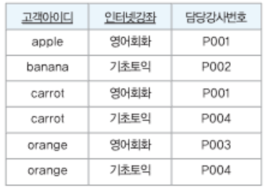

조건 1. 한 고객이 인터넷 강좌 여러 개 신청 가능, 동일한 인터넷 강좌는 여러 번 불가능

조건 2. 강사 한 명은 인터넷 강좌 하나만 담당 가능, 하나의 인터넷 강좌는 여러 강사가 담당 가능

후보키 : {고객아이디, 인터넷 강좌} / {고객아이디, 담당강사번호}

<aside>
💡

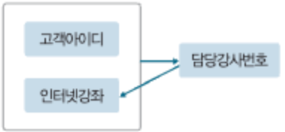

사진과 같이 담당강사번호가 후보키가 아님에도 인터넷강좌 속성을 결정하므로 보이스/코드 정규형에 속하지 않음

(기본키가 아닌 속성인 담당강사번호가 기본키에 완전 함수 종속되어있고, 이행적 함수 종속을 포함하지 않으므로 제2,3정규형에는 속함)

</aside>

> 위 경우 발생할 수 있는 이상현상(제3정규형을 만족함에도 발생)
>

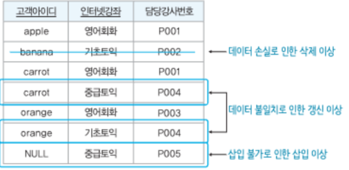

- 삽입 이상 : 신청한 고객이 없다면 강좌와 담당강사 삽입 불가(개체 무결성 제약 조건)
- 갱신 이상 : 하나의 강좌명만 변경시 강사 한 명당 인터넷 강좌 하나만 담당하는 전제 조건에 모순 발생
- 삭제 이상 : 고객이 강좌 신청 취소시 P002 강사가 기초토익을 담당하는 정보(유일한 튜플)도 함께 삭제

<aside>
💡

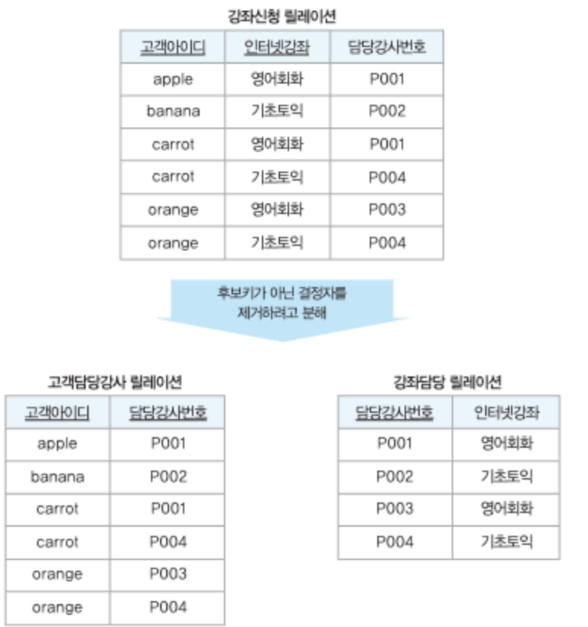

분해된 릴레이션에서 고객담당강사 릴레이션에서는 후보키가 아닌 결정자가 존재하지 않아 보이스/코드 정규형에 속함

강좌 담당 릴레이션에서는 후보키이자 기본키인 담당강사번호만이 유일한 결정자이기 때문에 보이스/코드 정규형에 속함

</aside>