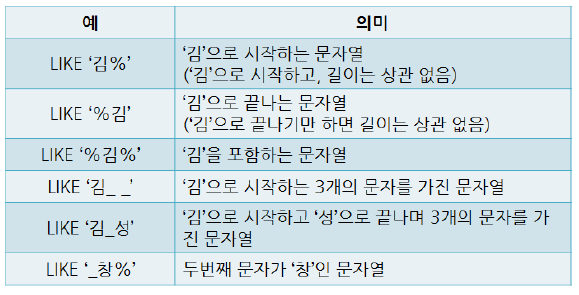

# 📌DDL(Data Definition Language)

## ✅Create Table : 테이블 생성

### ➡️속성의 정의

Not null : 널 값 허용하지 않음

Default : 기본 값 지정

```sql
create table user(
		id int primary key,
		grade int not null default 1
);
```

### ➡️키의 정의

> 기본키는 primary key 키워드로 지정(여러 개의 속성으로 구성 가능은 함)
>

```sql
create table user(
		name varchar(20) not null,
		grade int not null default 1,
		primary key (name, grade)
);
```

> 대체키는 unique 키워드로 지정(대체키는 기본키와 다르게 널 값 가능)
>

```sql
create table user(
		id int primary key,
		name varchar(20),
		unique (name)
);
```

> 외래키
>

외래키는 어떤 테이블의 무슨 속성을 참조하는지

**References 키워드로 반드시 명시 (참조 무결성 제약 조건)**

```sql
create table user(
		id int primary key,
		name varchar(20),
		class_id int,
		foreign key (class_id) references class(id)
); //unique로 지정된 대체키도 참조 가능
```

참조되는 테이블에서 투플을 함부로 삭제하거나 변경 못 함 따라서..

- 참조되는 테이블에서의 투플 삭제, 변경 조건 정의 방법

  (외래키가 참조하는 키(기본키)의 삭제, 변경 조건을 참조하는 쪽에서 걸어둠)

    <aside>
    💡

    1. On [Delete/Update] No Action : 투플을 삭제하거나 변경하지 못 한다.
    2. On [Delete/Update] Cascade : 관련 투플을 함께 삭제, 변경한다.
    3. On [Delete/Update] Set Null : 관련 투플의 외래키 값을 널로 변경한다.
    4. On [Delete/Update] Set Default : 관련 투플의 외래키 값을 미리 지정한 기본키 값으로 변경한다.
    </aside>

- 예시

    ```sql
    CREATE TABLE user (
        id INT PRIMARY KEY,
        name VARCHAR(20) NOT NULL unique,
        grade int not null default 1,
        class_id INT,
        FOREIGN KEY (class_id) REFERENCES class(id)
        ON DELETE SET NULL
        ON UPDATE CASCADE
    );
    ```


### ➡️데이터 무결성 제약조건 정의

> Check 키워드를 통한 속성에 대한 제약조건 지정
>

(Constraint 키워드는 제약 조건에 이름을 부여)

```sql
CREATE TABLE product (
    id INT PRIMARY KEY,
    price INT,
    CONSTRAINT chk_price CHECK(price >= 0)
);
```

## ✅Alter Table : 테이블 변경

### ➡️새로운 속성(컬럼) 추가

```sql
Alter table user add birthdate date;
```

### ➡️기존 속성(컬럼) 삭제

```sql
Alter table user drop column birthdate;
```

### ➡️새로운 제약조건 추가

```sql
Alter table product add constraint positive_price Check(price>0)
```

### ➡️기존 제약조건 삭제

```sql
Alter table product drop constraint positive_price
```

## ✅Drop Table

```sql
Drop table product //참조하고 있는 테이블이 있다면 삭제 안 됨
```

# 📌DML(Data Manipulation Language)

## ✅데이터 검색

### 1️⃣ 기본 검색

```sql
select [All | Distinct] from [Table];
select id from user;
select * from user;
select distinct first_name, last_name from employees;
//select문 바로 다음에 오는 것 주의
select name, number as num from user;
//as는 생략 가능
```

### 2️⃣ 산술식 검색

```sql
select name, price + 500 as change_price from product;
//값이 실제로 변하는 것은 아님
```

### 3️⃣ 조건 검색 (Where)

문자나 날짜 값도 비교 가능(A < C이며, 2022-12-01 < 2022-12-02이다.)

```sql
select name, number, age from user
where id = 3;

select name, price, company from product
where stock >= 10; and price < 10000;
```

### 4️⃣ LIKE 검색



```sql
select name, age, point from user
where name like '김%'; // 김으로 시작하는 사람

select * from user
where password like '_____'; //패스워드가 5자리인 사람
```

### 5️⃣ NULL 검색

특정 속성이 널 값인지 비교하려면 IS NULL 키워드 사용(where 안 됨)

만약 속성 값이 널이면 어떤 비교 연산자를 사용해도 결과가 모두 거짓

```sql
select id from product
where price is null; //가격이 정해지지 않은 제품 아이디

select name from user
where age is not null; //나이가 입력 된 고객 이름
```

### 6️⃣ 정렬 검색 (ORDER BY)

order by 키워드를 사용하며 기본 값은 오름차순

오름차순(알파벳 : 사전순, 날짜 : 빠른 순)

**널 값은 오름차순에서는 마지막, 내림차순에서는 먼저 출력된다**

```sql
select name, age from user
order by age desc;

select name, price, stock from purchase
where stock >=10
order by name asc, price desc; 
//이름순 오름차순 정렬 우선 처리 주의
//and 아님 주의. 논리 연산자는 where절 또는 조건식
```

### 7️⃣ 집계 함수 검색

| 함수 | 의미 | 사용 가능한 속성의 타입 |
| --- | --- | --- |
| COUNT | 속성 값의 개수 | 모든 데이터 |
| MAX | 속성 값의 최대값 | 모든 데이터 |
| MIN  | 속성 값의 최솟값 | 모든 데이터 |
| SUM | 속성 값의 합계 | **숫자 데이터** |
| AVG | 속성 값의 평균 | **숫자 데이터** |

주의 1. 집계 함수는 널 속성 값은 제외하고 계산

주의 2. 집계 함수는 where절에서 사용 불가, select 또는 having 절에서만 사용 가능

```sql
select avg(price) from product;

//as 사용시 공백이 있을 경우만 큰 따옴표 혹은 백틱 사용, 없다면 생략
select sum(stock) as total_stock from product
where company = 'orion';

//기본키 값으로 고객 수 세기
select count(id) as user_num from user;

//null이 있을 경우 카운트하지 않음 주의
select count(age) as user_num from user;// 나이 컬럼으로 고객 수 세기

//튜플 수 세기
select count(*) as user_num from user;

//이름 중복 제외 수 세기
select count(distinct name) as user_num from user;
```

### 8️⃣ 그룹별 검색 (GROUP BY)

특정 속성 값이 같은 투플을 모아 그룹을 만들고, 그룹별 검색을 하기위해 사용

그룹에 대한 조건은 GROUP BY 키워드와 함께 HAVING 키워드를 사용

**⭐Group by 절을 사용할 때는 해당 절에 있는 속성과 집계함수 이외의 속성은 select 절에서 사용할 수 없다.(Group by를 통해 함께 불러와야 한다.)**

```sql
select name, sum(num) as total_sale from purchase
group by name //이름별 판매량 합계 검색 (구매 테이블에서)
//group by 키워드를 사용할 때 쓰는 컬럼은 함께 호출하는 것이 좋음

select company, count(*) as num_product, max(price) as max_price
from product
group by company //회사별 제품 수와 최고가 검색

//Having 절에서 사용하는 집계함수 예제

//제품이 3개 이상인 회사별 제품 수와 최고가 검색
select company, count(*) as num_product, max(price) as max_price
from product
group by company having count(*) >=3 

//적립금 평균이 1000 이상인 등급의 회원수와 평균 적립금 검색
select grade, count(*) as user_num, avg(point) as avg_point
from user
group by grade having avg(point) >= 1000;

//⭐예제
select name, price, sum(stock) as stock_num
from product
group by name; //불가능 price 속성이 group by 절에 없고, 집계함수가 아니기 때문

select name, price, sum(stock) as stock_num
from product
group by name, price;//와 같이 작성해야 price 컬럼이 추가됨
```

### 9️⃣ 조인 검색

1. 일반적인 방식

    ```sql
    select product.name from product, purchase
    where purchase.username = 'sieon' and product.id = purchase.product_id;
    ```

2. Inner Join과 ON 키워드 사용 방식

    ```sql
    select p.name, p.price, o.date
    from product p inner join `order` o on p.id = o.product_id
    where p.price > 3000;
    ```

3. Outer Join과 ON 키워드 사용 방식

    ```sql
    select u.name, o.name, o.date
    from user u left outer join `order` o on u.id = o.user_id;
    //주문하지 않은(o.name, o.date에 null값이 있는) 고객 이름도 조회
    ```


### #️⃣ 서브 쿼리 검색

**order by 절을 사용할 수 없으며, 상의 질의문보다 먼저 수행된다.**

```sql
//⭐책 236~241p 참고⭐
```

## ✅데이터 삽입

### ➡️ 데이터 직접 삽입

```sql
//정의된 속성에 순서에 맞게 삽입해야함
insert into user values('sieon', '010-4559-5310', 24);

//명시한 속성에 맞게 삽입
insert into user(name, number) values('sieon', '010-4559-5310');
```

### ➡️ 질의문을 이용한 삽입

```sql
insert into product_hanbit(name, price, stock)
select name, price, stock from product
where company = 'hanbit';
```

## ✅데이터 수정

```sql
update product set name='bigpie'
where id = 3;

update product set price = price * 1.4; //모든 단가 1.4배

update product set stock = 0
where name in (select product_name from `order` where name = 'sieon');
//sieon이 주문한 제품의 제품명의 재고수를 제품 테이블에서 0으로 수정
```

## ✅데이터 삭제

```sql
delete from `user`
where name = 'sieon'

delete from product
where name in (select product_name from `order` where name = 'sieon');

delete from product //전체 튜플만 삭제(drop table과 다름)
```

# 📌VIEW

1. 일반 테이블과 달리 데이터를 실제로 저장하지 않음
2. 일반적으로 기본 테이블을 기반으로 만들어지지만, 뷰를 기반으로 뷰 생성 가능
3. 뷰를 통해 기본 테이블의 내용을 검색하기는 쉽지만, 조작 작업은 제한적임

### ➡️ 뷰의 생성

- WITH CHECK OPTION을 사용한지 않는다면, 조건을 위반한 데이터 삽입/수정 가능(단, 기본 테이블에 반영되지만 뷰에서 조회되지 않음)
- WITH CHECK OPTION을 사용한다면 정의 조건을 위반한 데이터 삽입/수정 불가능(기본 테이블에 반영도 안 됨)

```sql
create view vip_user(id, name, age, grade)
as select id, name, age, grade from `user`
where grade = 'vip'
WITH CHECK OPTION; //뷰의 정의 조건을 위반하는 수정 및 삭제 연산 시도 안 됨
```

⭐create view의 속성 리스트는 생략이 가능하지만(select 문으로 불러오는 순서를 따름), 집계 함수를 통해 계산되는 컬럼이 있다면 속성 이름을 명확히 모두 제시해줘야 한다.

```sql
create view company_stock(company, num_stock)
as select company, count(*) from product
group by company
WITH CHECK OPTION;
```

### ➡️ 뷰의 활용

1. 일반 테이블처럼 원하는 데이터 검색 가능(모든 뷰에 가능)
2. insert, update, delete문도 가능. 단, 기본 테이블을 들여다보는 창 역할인만큼 기본 테이블에 주는 변화는 제한적이다. (기본 테이블에서 어떤 튜플을 어떻게 변경할지 명확히 제시 불가능할 경우 제한 됨)

   > **기본 테이블의 기본키 속성을 포함하고 있는 뷰는 삽입, 삭제, 수정 연산이 모두 가능하지만, 기본키 속성이 없는 뷰는 어떤 튜플에 대한 연산인지 구분이 안 되기 때문.**
   >

   > 또는 집계함수에 의해 계산된 값을 속성으로 포함한 뷰도 연산이 불가능함.
   >

   이 외에도 다음 경우에는 수정, 삭제 연산이 불가능하다

   → Distinct 키워드를 포함해 정의한 뷰

   → Group by 절을 포함하여 정의한 뷰

   → 여러 개의 테이블을 조인하여 정의한 뷰(거의 불가능)

- **뷰의 장점**
    - 질의문을 더 쉽게 작성할 수 있음.
    - 데이터 보안 유지에 도움
    - 데이터 관리를 편리하게 해줌.

### ➡️ 뷰의 삭제

#### DROP VIEW 뷰_이름;