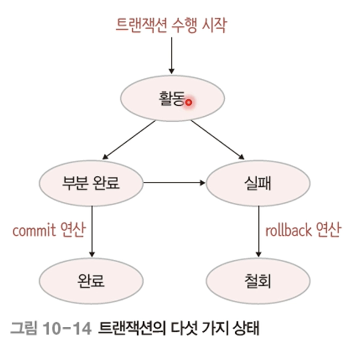
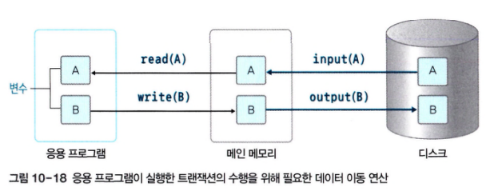
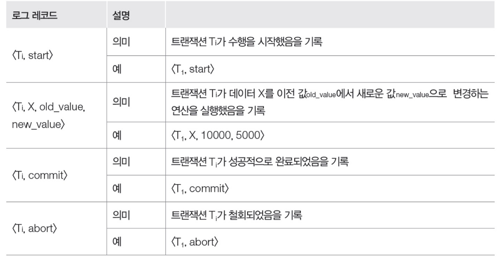
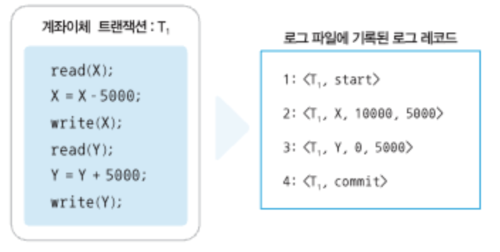
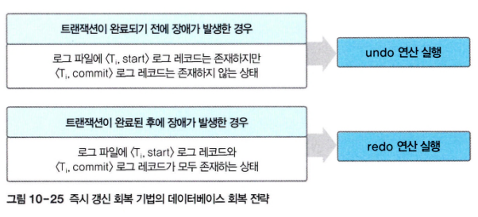
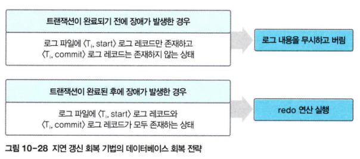

# 📌트랜잭션

## ✅ 트랜잭션이란

작업 하나를 수행하는 데 필요한 DB의 연산들을 모아놓은 것(논리적 작업 단위)

1. 다수의 사용자가 동시에 사용하더라도 항상 모순이 없는 정확한 데이터 유지
2. 장애가 발생하더라도 빠른 시간 내에 원래 상태로 복구

**트랜잭션의 모든 명령문이 완벽하게 처리되거나 하나도 처리되지 않아야 데이터베이스가 모순이 없는 일관된 상태를 유지할 수 있음 : (무결성, 일관성 유지)**

## ✅ 트랜잭션의 4가지 특성

### 1️⃣ Atomicity (원자성)

트랜잭션을 구성하는 연산들이  모두 정상적으로 실행되거나, 하나도 실행되지 않아야 함

> 장애가 발생하여 작업을 완료하지 못 했다면, 여태 실행한 연산 처리를 모두 취소하고 작업 전의 상태로 되돌려 원자성을 보장해야 한다.
>

### 2️⃣ Consistency (일관성)

트랜잭션이 성공적으로 수행된 후에도 데이터베이스가 일관된 상태를 유지해야 함

> 트랜잭션이 수행되는 과정에서는 데이터베이스가 일시적으로 일관된 상태가 아닐 수 있지만, 수행이 성공적으로 완료된 후에는 데이터베이스가 일관된 상태를 유지해야 한다.
>

### 3️⃣ Isolation (격리성)

현재 수행 중인 트랜잭션이 완료될 때까지 트랜잭션이 생성한 중간 연산 결과에 다른 트랜잭션들은 접근 불가

> 계좌이체 트랜잭션이 완료되기 전, 계좌 입금 트랜잭션이 잔액에 변경을 시도하면 모순된 데이터를 변경해 잔액을 정확히 예측하기 어려워 DB의 일관성을 보장할 수 없다.
>

### 4️⃣ Durability (지속성)

시스템 장애가 발생하더라도 트랜잭션 작업 결과는 없어지지 않고 데이터베이스에 그대로 남아 있어야 한다.

> 시스템 장애가 발생했을 때, 지속성을 보장하기 위한 데이터베이스 상태 복구 회복 기능이 필요하다.
>

## ✅ 트랜잭션 연산

1. commit 연산 : 트랜잭션의 수행이 성공적으로 완료되었음
2. rollback 연산 : 트랜잭션의 수행이 실패했음(지금까지 실행한 연산의 결과가 취소되고 수행 전 상태로 돌아간다)

## ✅ 트랜잭션 상태

<aside>

활동 상태 : 트랜잭션이 수행되기 시작하여 현재 수행 중

부분 완료 상태 : 마지막 연산이 실행된 직후, 수행 성공은 아직인 상태

완료 상태 : 트랜잭션이 성공적으로 완료되어 commit 연산을 실행한 상태

실패 상태 : 장애가 발생하여 트랜잭션의 수행이 중단된 상태

철회 상태 : 수행에 실패하여 rollback 연산을 실행한 상태(지금까지 실행한 트랜잭션의 모든 연산을 취소하고 수행되기 전의 데이터베이스 상태로 되돌리면서 종료

</aside>

- 트랜잭션이 완료 또는 철회 상태일 시 트랜잭션은 종료된 것으로 판단
- 철회 상태로 종료된 트랜잭션은 상황에 따라 다시 수행되거나 폐기

# 📌장애와 회복

## ✅ 장애 유형

1. 트랜잭션 장애 : 트랜잭션 수행 중 오류 발생(논리적 오류, 잘못된 데이터 입력, 처리 대상 데이터의 부재 등)
2. 시스템 장애 : 하드웨어 결함으로 발생(하드웨어 이상으로 메인 메모리에 저장된 정보 손실, 교착 상태가 발생한 경우 등)
3. 미디어 장애 : 디스크 장치의 결함으로 발생(디스크 헤드 손상, 고장 등)

## ✅ DB 저장 연산

### ➡️ 저장 장치 종류

| 저장 장치 | 설명 |
| --- | --- |
| 휘발성 저장 장치 | 장애 발생시 저장된 데이터 손실 (메인 메모리 등) |
| 비휘발성 저장 장치 | 장애가 발생해도 저장된 데이터 손실X 단, 디스크 헤더 손상 같은 장치 자체에 이상이 발생시 데이터가 손실될 수 있음 (디스크, 자기테이프, CD/DVD 등) |
| 안정 저장 장치 | 비휘발성 저장 장치를 이용해 데이터 복사본 여러 개를 제작, 어떤 장애가 발생해도 손실되지 않고 데이터 영구 저장 가능 |

일반적으로 데이터베이스는 비휘발성 저장 장치인 디스크에 상주

하지만 트랜잭션이 DB의 데이터를 처리하려면 디스크에서 메인 메모리로 가져와 이를 처리한 후 다시 디스크로 보내는 작업이 필요

> 디스크와 메인 메모리 간의 데이터 이동은 블록 단위로 수행 된다. 디스크 블록을 메인 메모리의 버퍼 블록으로 이동 시키는 연산과 메인 메모리의 버퍼 블록을 디스크 블록으로 이동 시키는 연산이 필요하다(input, output)
>

> 응용 프로그램에서 트랜잭션 수행을 지시하면 메인 메모리의 버퍼 블록을 프로그램 변수로 가져오고, 처리 결과를 저장한 변수 값을 메인 메모리의 버퍼 블록으로 옮기는 작업이 필요하다(read, write)
>

## ✅ 회복 기법

회복 : 장애가 발생했을 때 데이터베이스를 장애가 발생하기 전의 일관된 상태로 복구하는 것

### ➡️ 회복을 위한 연산

> 데이터를 별도의 장소에 미리 복사해두고, 장애로 문제 발생시 복사본을 이용해 원래의 상태로 복원. 덤프 또는 로그 방법을 사용
>
- 덤프 : 데이터베이스 전체를 다른 저장 장치에 주기적으로 복사
- 로그 : 데이터베이스에 변경 연산이 실행될 때마다 변경 이전 값과 변경 이후 값을 별도의 파일에 기록하는 방법

> 덤프 또는 **로그 방법**으로 중복 저장한 데이터를 이용해 redo나 undo 연산을 통해 복구한다
>
- redo : 가장 최근에 저장한 데이터베이스 복사본을 가져온 후 로그를 이용해 복사본이 만들어진 이후 실행된 모든 변경 연산을 재실행하여 장애 발생 직전의 데이터베이스 상태로 복구
- undo : 로그를 이용해 지금까지 실행된 모든 변경 연산을 취소하여 데이터베이스를 원래 상태로 복구

> 회복 연산에 로그가 중요하게 사용된다. 로그 파일은 레코드 단위로 기록되며, 데이터베이스에 대한 변경 연산 단위인 트랜잭션 수행과 함께 기록된다
>

### 1️⃣ 로그 회복 기법

> 즉시 갱신 회복 기법
>

<aside>

트랜잭션 수행 중에 데이터를 변경한 연산 결과를 로그 파일에 로그 레코드로 먼저 기록한 후 데이터베이스에 변경 연산을 즉시 반영한다.

장애 발생시 로그 파일의 기록을 참조하여 장애 발생 시점에 따라 redo나 undo 연산을 실행하여 데이터베이스를 복구한다

undo(취소) 연산은 로그의 역순으로 수행하며, redo(재실행) 연산은 로그의 정순으로 수행한다.

회복을 위해 두 연산이 모두 필요할 때는 undo 연산을 먼저 수행한 후 redo연산을 수행한다.

</aside>

> 지연 갱신 회복 기법
>

<aside>

트랜잭션 수행 중에 데이터를 변경한 연산의 결과를 즉시 반영하지 않고, 로그 파일에만 기록해두었다가, 트랜잭션이 부분 완료된 후에 로그에 기록된 내용을 데이터베이스에 한 번에 반영한다.

장애 발생시 로그에 기록된 내용을 버리기만 하면 데이터베이스가 원래 상태를 유지할 수 있다.

지연 갱신 회복 기법에서 undo 연산은 필요 없으며, 변경 이전 값을 기록할 필요도 없다. 따라서 변경 연산 실행에 대한 로그 레코드는 <T, X, new_value> 형식으로 기록

</aside>

> p388 ~ p393 장애 발생 시점별 회복 방식 확인
>

### 2️⃣ 검사 시점 회복 기법

로그 전체를 분석하여 모든 트랜잭션 대상으로 회복 연산을 결정하는 것은 비효율적

많은 시간이 걸리며, 불필요한 트랜잭션에도 연산이 발생함

> 검사 시점 회복 기법은 일정 시간 간격으로 검사 시점을 만들고, 장애 발생시 가장 최근 검사 시점 이후의 트랜잭션에만 회복 작업을 수행한다.
>

<aside>

검사 시점이 되면 메인 메모리의 모든 로그 레코드를 안정 저장 장치에 있는 로그 파일에 기록하고, 트랜잭션의 데이터 변경 내용도 데이터베이스에 반영한다.

그 다음 <checkpoint L> 형식의 로그 레코드를 로그 파일에 기록하여 검사 시점을 저장한다. (L은 현재 실행되고 있는 트랜잭션의 리스트)

장애 발생시 로그 파일에서 가장 최근의 <checkpoint L> 로그 레코드를 찾아 이후의 로그 기록에만 회복 작업을 수행한다.

</aside>

**<checkpoint L>을 통해 회복 작업의 범위를 정하고, 해당 범위 내에서 즉시 갱신 회복 기법이나 지연 갱신 회복 기법을 이용해 회복 작업을 수행한다**

### 3️⃣ 미디어 회복 기법

디스크에서 발생할 수 있는 장애에 대비한 회복 기법

일정 주기마다 다른 안전한 저장 장치에 복사해두는 덤프를 이용(CPU 낭비될 수 있음)

장애 발생시 가장 최근에 복사해둔 덤프를 이용해 데이터베이스를 복구한다. 이후 필요에 따라 로그의 내용을 토대로 redo 연산을 실행한다.