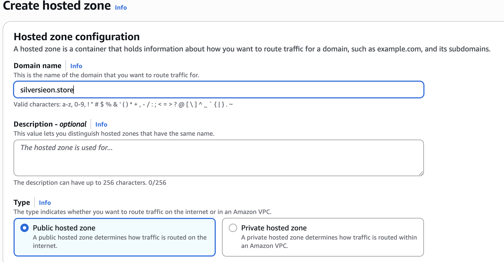
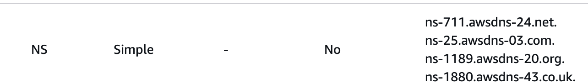
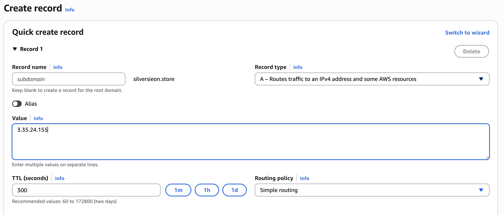
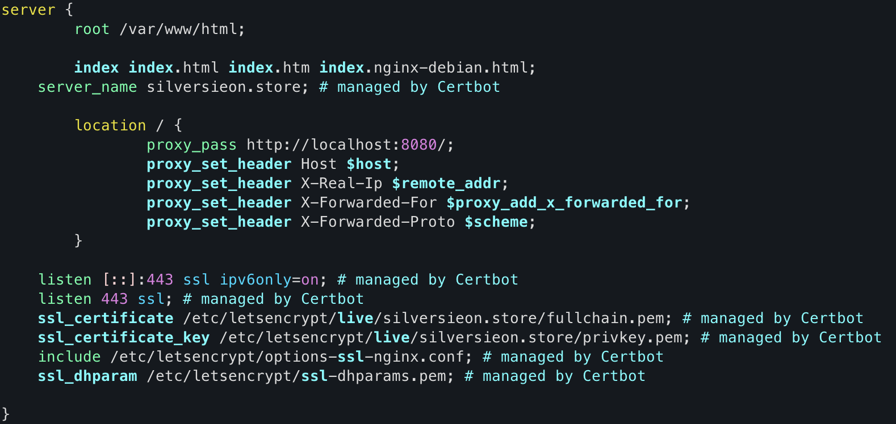

## 📌HTTP로 배포하기

### 1. Launch instances

<aside>

1. Name and tags : 인스턴스 이름→자유 설정
2. Amazon Machine Image(AMI) : 인스턴스 환경(운영체제 설정) → Ubuntu
3. Instance Type : 인스턴스가 가지는 하드웨어 유형(Cpu, Ram, GPU가 다름) → 테스트용, 프리티어 사용자는 t2.micro, t3.micro 가능
4. Key pair : 서버에 접속하기 위한 키 페어(.pem) → 생성할 인스턴스마다 하나씩 붙어야함(이전에 만든 키 재사용 가능)
5. Network settings : 인스턴스 네트워크 설정→ wellknown 포트 열어두고, 내가 실행시킬 빌드 파일 포트번호(8080, ..), MySQL 포트번호(3306) Custom TCP로 열어두기
6. Configure storage : 인스턴스가 가지는 저장장치 용량, 속성 구성(HDD, SSD) → gp3(ssd유형) 8Gib(ssd크기) 그대로 두면 됨
</aside>

### 2. ssh 설정

1. 생성된 ~.pem 키를 ~/.ssh 폴더로 이동(사용의 편의를 위해서)
2. vi config를 통해 ssh 접속을 편리하게 하기위한 설정 파일 생성, 다음과 같이 작성

```yaml
#EC2연습
Host ec2-demo #접속할 ssh 별칭
        HostName 43.201.107.45 #실제 접속할 서버의 IP 주소
        User ubuntu #서버에 접속할 때 사용할 기본 사용자 이름
        Port 22 #해당 서버의 ssh 포트 번호(기본은 22지만 바뀌었을 시 명시)
        IdentityFile ~/.ssh/practice.pem #서버에 접속할 때 사용할 개인 키, 비밀번호 대신 인증에 사용
```

### 3. ssh 연결

아래 명령어를 통해 생성한 인스턴스에 SSH로 접속시도

```bash
ssh ec2-demo
```

- ⭐️연결 내부 로직⭐️
    1. 포트번호 22(ssh)로 TCP 연결을 시도
    2. 서버는 자신의 공개키를 클라이언트에게 전송
        - 처음보는 서버 → 키를 저장 후 경고 출력Are you sure you want to continue connecting (yes/no/[fingerprint])?
        - 이전에 본 키와 다름 → 경고 또는 연결 차단
    3. 사용자 인증(키 or 비밀번호)을 통해 클라이언트는 자신의 개인키로 서명해서 서버로 보내면 서버는 등록된 공개키로 서명이 맞는지 확인(비밀번호도 가능)
    4. 암호화된 세션 설정에서 클라이언트와 서버가 합의해서 암호화 알고리즘, 세션키 등을 정하고 채널 수립
    5. 원격 쉘(ec2 인스턴스의 쉘) 열림 이후 해당 인스턴스의 CLI에서 작업 가능

### 4. EC2 서버 설정

```bash
sudo apt update #현재 시스템에서 설치 가능한 소프트웨어 패키지 목록 갱신

#jdk21 설치 ( -y는 모든 질문에 응답 자동 yes)
sudo apt install openjdk-21-jdk -y
java --version #설치 완료된 후 자바 버전 확인

sudo apt install mysql-server -y
mysql --version
```

### 5. MySQL 설정

```bash
sudo mysql -u root

alter user 'root'@'localhost' identified with mysql_native_password by '새비밀번호';
exit

mysql -u root -p
Enter password: 변경된 비밀번호 입력

create database (DB명);
exit
```

### 6. EC2 swap memory 설정

❗️하나의 인스턴스에서 스프링부트와 Mysql을 동시에 실행시 t2.micro(freetire) 설정상 1Gib 램을 사용하기 때문에 OutOfMemory 발생 → swapfile 메모리를 할당하여 부족한 메모리를 디스크 용량으로 대체

- 내부 로직

  <부족한 램 용량을 남는 저장장치 용량을 통해서 램처럼 사용하는 방식>

  OS가 실제로 Ram이 부족해지면 사용 빈도가 낮은 메모리 페이지를 디스크(swapfile)에 저장

  Ram을 확보해서 프로세스가 죽지 않게 유지

  필요시 다시 디스크에서 읽어와 램에서 사용


```bash
#1. 느리지만 안전한 방식으로 스왑 파일 생성
sudo dd if=/dev/zero of=/swapfile bs=128M count=16

# dd : 저수준 복사 명령어
# if=/dev/zero : inputfile이 전부 0으로 채워진 가상장치(디스크에 실제로 내용 작성O)
# of=/swapfile : outputfile로 swapfile 생성
# bs=128M : 블록 크기는 128MB
# count=16 : 16개 블록 생성-> 총 128M x 16 = 2048 = 2GB

#2. 빠르지만 덜 안전한 방식으로 스왑 파일 생성
sudo fallocate -l 2G /swapfile

# fallocate : 파일을 특정 크기로 빠르게 생성하는 명령어(디스크에 실제로 내용 작성X : 희소파일)
# -l 2G : --length의 약자로 파일 크기를 2GB로 설정
# /swapfile : 스왑파일 만들 경로
```

```bash
# 보안상 권한 제한(읽기, 쓰기 가능하도록)
sudo chmod 600 /swapfile

#스왑 영역으로 포맷(/swapfile 이라는 파일을 리눅스 커널이 스왑 메모리로 인식할 수 있게 만듦)
sudo mkswap /swapfile

#스왑 사용 시작(해당 파일을 스왑 메모리로 활성화)
sudo swapon /swapfile

#부팅시 자동으로 swapfile을 마운트(활성화) 하도록 설정
echo '/swapfile none swap sw 0 0' | sudo tee -a /etc/fstab

# echo 'swapfile none swap sw 0 0' : '...' 안의 문자열 출력
# | : 파이프를 통해 위 명령어의 출력을 tee 명령의 입력으로 전달
# tee : 표준 입력을 받아 파일로 저장(기본은 덮어쓰기)
# -a : append의 약자로, 기존 파일 내용 유지하고 맨 끝에 덧붙임
# /etc/fstab : 수정할 파일. 부팅시 마운트 대상 정의하는 시스템 설정 파일

# ⭐️⭐️⭐️
# sudo tee -a /etc/fstab 을 입력후 직접 표준 입력으로 문자열 넣어도됨
# 다만 Enter(개행문자로 취급하여 다음줄로 넘어감)이 아닌
# ctrl + D(표준 입력을 마침) 를 눌러 EOF(파일, 입력스트림이 끝남)임을 알려줘야함 
```

```bash
#스왑 메모리 활성화 확인(-s :summary 약자로 요약해서 확인)
sudo swapon -s
```

### 7.  jar 파일 빌드, 인스턴스에 복사

배포할 프로젝트 터미널(로컬)에서

```bash
./gradlew clean build

# permission denied 발생시 권한 열어주기
chmod +x ./gradlew

# 만약 테스트 케이스 관련 문제 발생시
# @Test 어노테이션 삭제 또는
# @SpringBootTest(classes = SpringPracticeApplication.class)를 붙여
# 테스트를 구성할 수 있는 메인 클래스의 코드들 제공 또는 테스트 케이스 없이

./gradlew clean build -x test
```

이후 scp(Secure Copy Protocol)을 통해 원격 서버에 로컬 시스템 파일을 복사

```bash
# scp [옵션] [소스 경로] [대상 경로]
scp -i {pem키 경로} ./build/libs/springpractice-0.0.1-SNAPSHOT.jar ubuntu@{탄력 IP}:/home/ubuntu

#.ssh에 config 설정을 해놓은 경우
scp ./build/libs/springpractice-0.0.1-SNAPSHOT.jar ec2-demo:/home/ubuntu
```

### 8. 인스턴스에서 빌드된 파일 실행

```bash
nohup java -jar {빌드된 프로젝트 파일명}.jar > app.log 2>&1 &

# nohup : no hang up의 약자, 터미널을 종료해도 프로세스가 동작하도록 함
# (보통 ssh 세션 끊기면 프로세스도 죽음, 디폴트로 로그를 nohup.out에 저장)

# java -jar {빌드된 파일명}.jar : 스프링부트 어플리케이션 실행
# > app.log : 실행의 표준 출력을 app.log 파일에 저장 (기존 로그파일 존재시 덮어씌움)
# 2>&1 : 표준 에러를 표준 출력과 같은 곳으로 보냄
# & : 백그라운드 실행(명령어 실행 후에도 쉘이 계속 사용 가능)
```

- ⭐️추가로 알아야 할 명령어들

    ```bash
    # java로 실행 중인 프로세스 찾기
    ps -ef | grep java
    
    # ps : process status의 약자 (실행 중인 프로세스 목록 출력)
    # -ef : 모든 사용자의 프로세스(e), 풀 포맷(전체 정보) (f)
    # | grep java : java가 들어가는 프로세스만 확인
    
    # PID로 프로세스 강제 종료 시키기
    kill -9 {PID}
    
    # 실시간 로그보기
    tail -f app.log
    
    # tail : 해당 파일의 마지막 10줄 출력
    # -f : 새로운 내용이 생기면 자동 출력
    # tail -n 50 app.log : 마지막 50줄 출력
    # tail -n 100 -f app.log : 마지막 100줄 출력하고 새로운 로그 생기면 계속 출력
    
    # jar 파일 내부 확인(목록 확인만)
    jar tf {빌드된 프로젝트 파일명}.jar
    
    # jar 파일 압축 풀기(-d는 destination)
    unzip {빌드된 프로젝트 파일명}.jar -d {output_path}
    ```


### 9. http://{탄력 IP}:8080/swagger-ui/index.html#/

주소를 웹브라우저 주소창에 입력해 스웨거 확인

http 배포 완료!

---

## 📌HTTPS로 배포하기

### 1. 가비아에서 도메인 구매

가비아 회원가입, 원하는 도메인을 입력 후 500원짜리 유효기간 1년으로 구매

<aside>

가비아란 대한민국 대표 도메인 등록기관, 호스팅 서비스 제공업체

DNS : 해당 도메인을 IP주소로 변환, 연결해주는 서비스

네임서버 제공 : DNS를 수행하는 서버 제공

구매한 도메인은 이후 네임서버를 바꿔서 AWS, Netlify 등에서 관리 가능

</aside>

### 2. AWS Route53에 내 도메인 DNS 설정 공간 생성

AWS Route53에서 Create hosted zone 클릭, 아래와 같이 구매한 도메인 작성 후 생성



지정한 도메인용 DNS 설정 공간이 생성됨

이때 AWS가 네임서버 4개를 자동으로 생성하는데, 이를 가비아에 등록해줘서

“해당 네임서버에서 관리할 거예요”라고 알려줘야함

### 3. 가비아에 AWS 네임서버 등록

가비아→My가비아→도메인 (n건)→관리→네임서버 설정

1차, 2차, 3차. 4차에 들어갈 네임서버 주소를 본인 Route53 네임서버 목록에서 붙여넣기

(가비아에 “해당 AWS 네임서버에서 이 도메인을 관리할 거예요”라고 알려주는 과정)



❗️주의 사항❗️

<aside>

1. 위에서부터 1차, 2차, 3차, 4차 순으로 잘 확인하며 넣기(가비아에서 순서 맞추기)
2. 주소 맨 끝에 .은 빼줘야함(1차 주소의 경우 ns-711.awsdns-24.net)
3. 공백이 들어가선 안 됨
</aside>

### 4. Route53 DNS 설정 공간에 도메인-탄력 IP 연결

Route53→ Hosted zones → Create record

Value에 본인의 인스턴스 탄력 IP를 입력

(AWS Route53의 도메인이 어느 IP주소로 변환되면 되는지 알려주는 과정)



### 5. 인스턴스에 Nginx 설치 및 확인

- Nginx가 무엇이고 왜 쓰는지 참고

  [Nginx](https://www.notion.so/Nginx-22bbe780857480988901d9e96931cc00?pvs=21)


nginx 설치

```bash
sudo apt update && sudo apt install nginx -y
```

nginx 설치 확인, 버전 확인

```bash
sudo systemctl status nginx

# systemctl : 시스템 서비스를 관리하는 명령어
# status : 지정한 서비스의 현재 상태를 보여줌
# nginx : 지정한 서비스(nginx)

nginx -v
```

웹브라우저 주소창에 http://{내 도메인} 입력후 “Welcome to nginx!” 뜨면 성공

❗️반드시 http로 요청 보내야함(아직 secure 인증서 발급을 받지 않았기 때문)

### 6. CertBot으로 SSL 적용

Let’s Encrypt : 무료 SSL 인증기관

certbot : 이 인증서를 자동 발급 + 설치 + 갱신해주는 툴

certbot 설치

```bash
sudo apt update && sudo apt install certbot python3-certbot-nginx -y
```

Nginx용 SSL 인증서 자동 발급 + 설정

```bash
sudo certbot --nginx

# 1. 인증서를 받을 이메일 입력 및 약관 동의
## 1-1. Let's Encrypt 약관 동의 (Y)
## 1-2. 뉴스레터 수신여부 (N)
# 2. 인증서를 적용할 도메인 입력
```

### 7. Nginx가 받은 요청 리버스 프록시 설정

- Proxy

  [Proxy](https://www.notion.so/Proxy-22bbe7808574803b9a39f0ceef12b985?pvs=21)


리버스 프록시 : Web Server인 Nginx(중간 서버)가 앞단에서 (도메인→IP 주소)를 통해 받은 요청을 내부 WAS(SpringBoot)로 전달하고 받은 응답을 다시 클라이언트에게 되돌려 줌

```bash
sudo vi /etc/nginx/sites-enabled/default
```

두 번째 server 블록(https 443 관련)에 리버스 프록시 설정 추가



```
proxy_pass http://localhost:8080/;
                proxy_set_header Host $host;
                proxy_set_header X-Real-Ip $remote_addr;
                proxy_set_header X-Forwarded-For $proxy_add_x_forwarded_for;
                proxy_set_header X-Forwarded-Proto $scheme;
```

- 각 문장별 설명
    1. 요청을 8080포트로 전달
    2. 원래 요청 도메인 값을 Spring서버로 전달
    3. 실제 사용자의 IP 주소를 백엔드에 전달
    4. 프록시를 거쳐온 전체 IP 경로 리스트 전달
    5. 클라이언트가 사용할 프로토콜(HTTP, HTTPS)를 백엔드에 전달

nginx 문법 검사 및 재실행을 통해 ssl 인증서 적용

```bash
sudo nginx -t

sudo nginx -s reload
```

### 8. https://{본인 도메인}/swagger-ui/index.html#/

주소를 웹브라우저 주소창에 입력해 스웨거 확인

https 배포 완료!