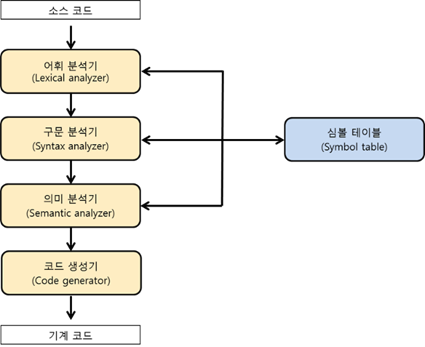

# 1장 : 기본 사항

## 🎯소프트웨어 개발, 유지보수에 언어가 미치는 요소 고려

### ➡️판독성(Readability)

프로그램을 쉽게 읽고 이해할 수 있는 척도(유지보수와 연관)

1. 단순성 : 언어의 기능이 복잡하지 않아야함
2. 직교성 : 독립된 기본 구조들이 조합되어 제어, 데이터 구조 생성 능력(문맥 독립성). Algol68에 최초 적용
3. 제어문 : 충분한 제어문 필요 (while, for 등)
4. 데이터 타입/구조 : boolean 타입 및 구조체 등의 제공이 필요
5. 구문 고려사항 : 식별자 형태 및 예약어 필요

### ➡️작성력(Writeability)

프로그램 생성에 언어가 쉽게 사용될 수 있는 정도

1. 추상화 : 데이터, 함수 추상화 및 추상데이터 타입(class 탄생)
2. 표현력 : 증감식 및 switch-case 문 등

### ➡️신뢰성(R**eliability)**

프로그램이 모든 조건하에서 주어진 명세를 수행하는 척도

1. 타입 검사 : 컴파일 또는 런타임 중 타입 오류 검사
2. 예외 처리 : 오류 수정, 계속 실행
3. 별칭 : 링크로의 참조

### ➡️비용(cost)

1. 컴파일 비용, 언어 구현 비용, 유지보수 비용 등이 중요함

### ➡️이외의 평가 기준

1. 이식성 : 언어의 표준화와 연관
2. 일반성 : 광범위한 응용 분야에 적용성
3. 분명성 : 공식 문서의 완전성과 정밀성

## 🎯언어 설계에 미친 영향

### ➡️컴퓨터 구조(폰 노이만)

- 명령형 언어 : 폰 노이만 구조에 기반한 언어 (변수, 배정문, 반복문 등)
- 데이터와 프로그램은 동일한 메모리에 저장, CPU는 메모리로부터 분리 후 연산 수행

### ➡️프로그래밍 방법론

70년대 초에 타입 검사 및 구조 지원

70년대 후반에 추상 데이터 타입 지원 (SIMULA 67)

80년대에 객체지향 설계 방법론 등장, 데이터 추상화, 상속 및 동적 바인딩 (Smalltalk, C++, Java, Ada95, C#)

## 🎯언어의 부류

### ➡️명령형 언어 vs 함수 언어

명령형 언어 : 일반적인 명령형 평범한 언어

- 함수 언어(Lisp 등)
1. 특정 컴퓨터 구조에 독립적, 수학 함수에 기반
2. 변수, 배정문, 반복문 사용X, 재귀 함수 사용

### ➡️논리 언어

1. 기호 논리에 기반, 규칙 기반 언어
2. 제어 구조가 없고, 순서 없이 기술됨

### ➡️객체지향 언어

1. 객체를 만들고, 객체들 간의 상호작용을 통해 계산 (Smalltalk)

### ➡️비주얼 언어

1. 명령형 언어의 부속 부류
2. 프로그램에 그래픽 사용자 인터페이스 생성 등의 간단한 방식 제공
3. Drag & Drop 기능 (Visual BASIC 등)

### ➡️스크립트 언어

1. 명령형 언어의 부속 부류
2. HTML 문서 안에 끼워 동적인 Web 페이지 만드는 언어
3. 부분 또는 순수 해석 (PHP, JS, ASP 등)

## 🎯구현 방법

### ➡️컴파일

소스 프로그램을 실행 가능한 기계 언어로 번역

기계 코드는 매우 빠르게 실행될 수 있음.

어휘 분석 : 소스 프로그램의 문자를 어휘 단위로 변환

구문 분석 : 어휘 단위를 프로그램의 구문 구조를 나타내 구문 분석 트리로 변환

의미 분석 : 중간 코드 생성

코드 생성 : 기계어 코드 생성

이후 링킹과 로딩 과정을 거침

### ➡️순수 해석

프로그램이 인터프리터에 의해서 해석되면서 실행

인터프리터는 언어에 대한 가상 기계 제공 (APL, LISP, JS, PHP 등)

### ➡️컴파일러 순수 해석 혼합

프로그램을 중간 코드로 번역하고, 이 중간 코드를 해석 (Java, .NET 등)

### ➡️전처리기(Preprocessor)

프로그램을 번역하기 직전에 프로그램 처리(매크로 확장기 기능)

## 🎯정리

### 프로그래밍 언어 평가 기준

1. 판독성
2. 작성령
3. 신뢰성
4. 비용

### 언어 설계에 가장 큰 영향을 미치는 것

1. 기계 구조
2. 소프트웨어 설계 방법론

### 프로그래밍 언어를 구현하는 주요 방법

1. 컴파일
2. 순수해석
3. 혼합형(컴파일 + 순수해석)