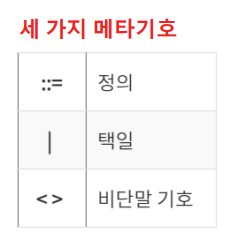

# 3장 : 구문과 의미론

## 🎯서론

- 구문(syntax) : 표현식, 문장, 프로그램 단위의 형태 또는 구조. 문법으로 표현
- 의미론(semantics) : 표현식, 문장, 프로그램 단위의 의미

구문과 의미론은 언어의 정의를 제공

구문론 : 프로그램의 표면적인 구조를 정의, 어떤 형태로 작성해야 하는지 기술

의미론 : 프로그램의 내용적인 효과를 정의, 실행시 어떤 일이 일어나는지 의미를 기술

## 🎯구문 기술의 일반적인 문제

1. 언어(language) : 알파벳 문자로 구성된 문자열의 집합
2. 어휘 항목(lexeme) : 언어에서 가장 낮은 단계 구문적 단위
3. 토큰(token) : 어휘 항목의 카테고리 ex) index = 2 * count + 17; (각각을 토큰이라고 함)
4. id(identifier) : 문자열(lexeme)이 변수명, 함수명, 클래스명 등을 이룰 때

프로그램은 어휘(토큰)를 모아 구문을 작성하여 구성한다. [id의 문법적 표현]

- 언어의 형식적 정의
1. 언어 인식기 : 문법 검사
2. 언어  생성기 : 문법을 통한 출력

## 🎯구문 기술의 형식적 방법

### ➡️문맥-자유 문법(CFG : context-free grammers)

- 규칙(문법) : 비단말 기호를 단말 기호와 비단말 기호의 조합으로 정의

비단말(Nonterminal) 기호 : 정의될 대상

단말(Terminal) 기호 : 언어에서 직접 사용되는 표현

시작 비단말 기호 : 문장을 만들 때 처음 시작하는 기호

### ➡️BNF(BNF : Backus-Naur Form)

문맥 자유 문법의 일종 중 하나

Algol의 구문을 정의하기 위해 사용된 표현법

비단말 기호 : <>로 묶인 기호

단말 기호 : 비단말 기호와 메타 기호가 아닌 기호

규칙 : ::=를 기준으로 왼쪽 부분을 오른쪽 부분으로 정의

[외 자료 참고. 연산자 우선 순위 전까지]

### ➡️연산자 우선순위

문법 상에 연산자 우선순위를 부여

1. 파스 트리의 낮은 위치의 연산자가 높은 위치의 연산자보다 높은 우선순위
2. 파스트리 위치로 연산자 우선순위 구분시 모호성 제거 가능

### ➡️EBNF(Extended BNF)

[자료 참고]

## 🎯프로그램 의미 기술 : 동적 의미론

- 의미론 : 프로그램의 내용적인 효과를 정의, 실행시 어떤일이 일어나는지 의미 기술
- 정적 의미론 : 프로그램 수행 전 의미가 맞는지 파악하는 방법(주로 타입 검사, **속성 문법)**
- 동적 의미론 : 프로그램 수행 시 나타나게 될 의미를 표현하는 방법 (기능적 의미론, 표기적 의미론, 공리적 의미론 등)

## 🎯속성 문법

정적 의미론 및 프로그램 구문 모두를 기술하기 위해 설계된 문법

[속성 문법 : 예제]

[각 의미론 ppt 참고]