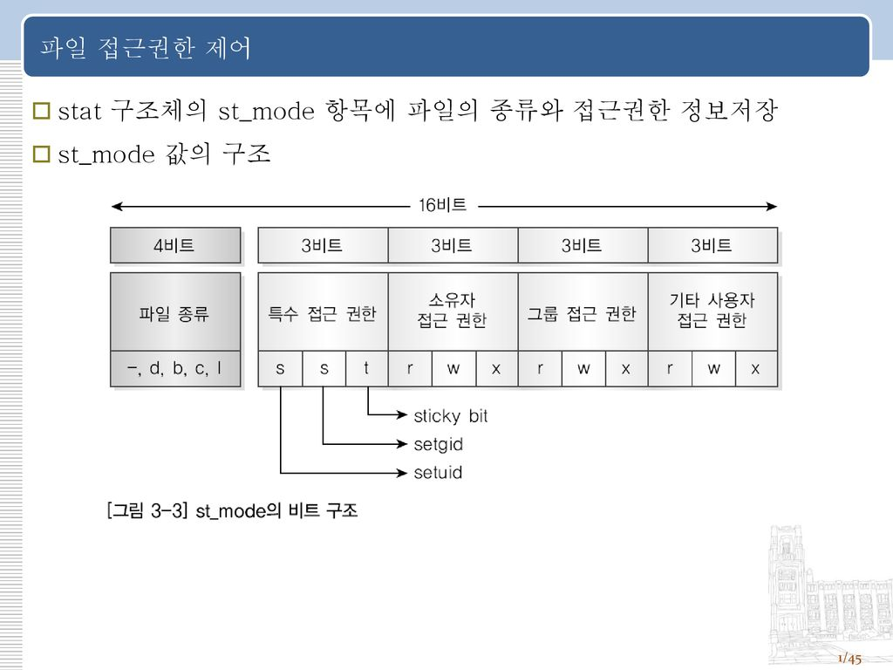
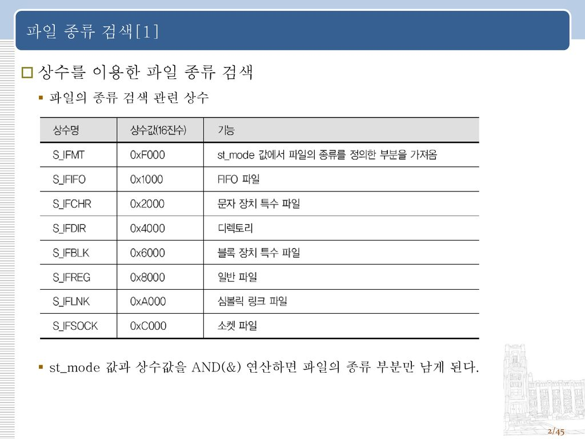
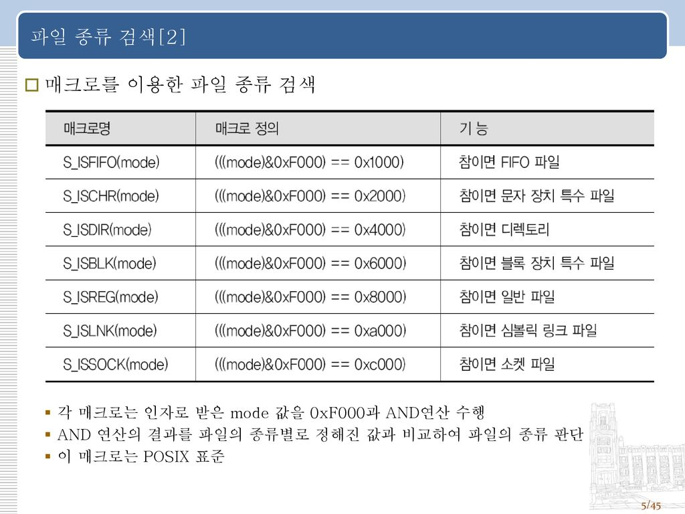
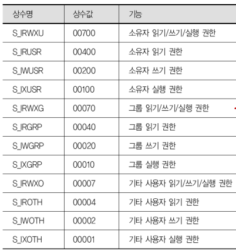

## ✅개요

- inode 정보 검색은 stat 구조체에 저장된다.

파일 정보 검색 함수 : stat, fstat

- 접근 권한 정보

  : ls -l 명령어로 확인 가능. 프로그램에서 접근 권한을 확인하려면 stat 구조체 사용 또는 accss, chmod, fchmod 로 확인 가능하다.

파일 접근 권한 함수 : access, chmod, fchmod

- 링크

  : 기존 파일이나 디렉터리에 접근할 수 있는 새로운 이름을 의미.

하드 링크 : 기존 파일과 동일한 inode 사용

심벌릭 링크 : 파일에 접근할 수 있는 다른 파일 (기존 파일과 다른 inode 사용)

## ✅파일 정보 검색

### ➡️파일명으로 파일 정보 검색 : stat(2)

함수 원형 : int stat(const char*pathname, struct stat *statbuf);

예시 :

```c
#include <sys/types.h>
#include <sys/stat.h>
#include <unistd.h>
#include <stdio.h>

int main() {
	struct stat statbuf;
	//stat 함수로 검색한 inode 정보는 stat 구조체에 저장되어 리턴
	stat("linux.txt", &statbuf); //성공시 0, 실패시 -1 리턴
	
	//inode 번호
	printf("Inode = %d\n", (int)statbuf.st_ino);
	//파일 종류 및 접근 권한
	printf("Mode = %o\n", (unsigned int)statbuf.st_mode);
	//하드 링크 개수
	printf("Nlink = %o\n", (unsigned int)statbuf.st_nlink);
	//파일 소유자의 UID
	printf("UID = %d\n", (int)statbuf.st_uid);
	//파일 소유 그룹의 GID
	printf("GID = %d\n", (int)statbuf.st_gid);
	//파일 내용을 입출력할 때 사용하는 버퍼 크기
	printf("Blksize = %d\n", (int)statbuf.st_blksize);
	//파일에 할당된 파일 시스템 블록 수 (블록의 크기는 512바이트)
	printf("Blocks = %d\n", (int)statbuf.st_blocks);
	
	printf("** timespec Style\n");
	//마지막으로 읽거나 실행한 시각
	printf("Atime = %d\n", (int)statbuf.st_atim.tv_sec);
	//마지막으로 변경(쓰기)한 시각
	printf("Btime = %d\n", (int)statbuf.st_mtim.tv_sec);
	//마지막으로 inode 내용을 변경한 시각
	printf("Ctime = %d\n", (int)statbuf.st_ctim.tv_sec);
	printf("** old Style\n");
	printf("Atime = %d\n", (int)statbuf.st_atim);
	printf("Btime = %d\n", (int)statbuf.st_mtim);
	printf("Ctime = %d\n", (int)statbuf.st_ctim);
}
```

### ➡️파일 기술자로 파일 정보 검색 : fstat(2)

함수 원형 : int fstat(int fd, struct stat *statbuf);

예시 :

```c
#include <sys/types.h>
#include <sys/stat.h>
#include <fcntl.h>
#include <unistd.h>
#include <stdlib.h>
#include <stdio.h>

int main() {
	int fd;
	struct stat statbuf;
	
	fd = open("linux.txt", O_RDONLY);
	if(fd==-1) {
		perror("open : linux.txt");
		exit(1);
	}
	
	fstat(fd, &statbuf)
	
	printf("Inode = %d\n", (int)statbuf.st_ino);
	printf("UID = %d\n", (int)statbuf.st_uid);
	close(fd);
}
```

## ✅파일 접근 권한 제어



- 파일 종류 검색



방식1 예제 :

```c
#include <sys/types.h>
#include <sys/stat.h>
#include <stdio.h>

int main() {
	struct stat statbuf;
	int kind;
	
	stat("linux.txt", &statbuf);
	
	printf("Mode = %o\n", (unsigned int)statbuf.st_mode);
	
	//파일 종류 비트를 가져오기 위한 비트 마스크외 &연산
	kind = statbuf.st_mode & S_IFMT;
	printf("Kind = %o\n", kind);
	
	switch(kind) {
		case S_IFLNK:
			printf("linux.txt is symbolic link\n");
			break;
		case S_IFDIR:
			printf("linux.txt is directory\n");
			break;
		case S_IFREG:
			printf("linux.txt is regular file\n");
			break;
	}
}
```



방식2 (권장) 예제 :

```c
#include <sys/types.h>
#include <sys/stat.h>
#include <stdio.h>

int main() {
	struct stat statbuf;
	int kind;
	
	stat("linux.txt", &statbuf);
	
	printf("Mode = %o\n", (unsigned int)statbuf.st_mode);
	
	if(S_ISLNK(statbuf.st_mode))
		printf("linux.txt is symbolic link\n");
	if(S_ISDIR(statbuf.st_mode))
		printf("linux.txt is directory\n");
	if(S_ISREG(statbuf.st_mode))
		printf("linux.txt is regular file\n");
}
```

- 파일 접근 권한 검색



예제 :

```c
#include <sys/types.h>
#include <sys/stat.h>
#include <stdio.h>

int main() {
	struct stat statbuf;
	
	stat("linux.txt", &statbuf);
	
	printf("Mode = %o\n", (unsigned int)statbuf.st_mode);
	//USR(소유자), GRP(그룹), OTH(기타 사용자)
	if((statbuf.st_mode & S_IRUSR) != 0)
		printf("user has a read permission\n");
	if((statbuf.st_mode & S_IWUSR) != 0)
		printf("user has a write permission\n");
	if((statbuf.st_mode & S_IXUSR) != 0)
		printf("user has a execute permission\n");
}
```

### ➡️함수를 이용한 접근 권한 검색 : access(2)

함수 원형 : int access(const char *pathname, int mode);

예시 :

```c
#include <sys/errno.h>
#include <unistd.h>
#include <stdio.h>

int main() {
	int perm;
	//R_OK : 읽기 권한 확인, W_OK : 쓰기 권한 확인, X_OK : 실행 권한 확인, F_OK : 파일이 존재하는지 확인
	if(access("linux.bak", F_OK) == -1 && errno ==ENOENT)
			printf("linux.back : File no exist.\n");
			
	perm = access("linux.txt", R_OK);
	
	if(perm == 0)
			printf("linux.txt : Read permission is permmitted.\n");
	else if(perm == -1 && errno ==EACCES)
			printf("linux.txt : Read permission is not permmitted.\n");
}

```

### ➡️파일명으로 접근 권한 변경 : chmod(2)

함수 원형 : int chmod(const char *pathname, mode_t mode);

예시 :

```c
#include <sys/types.h>
#include <sys/stat.h>
#include <stdio.h>

int main() {
		struct stat statbuf;
		//linux.txt 파일에 다음 권한들 추가(|연산자를 통해서)
		chmod("linux.txt", S_IRWXU|S_IRGRP|S_IXGRP|S_IROTH);
		//linux.txt 파일의 상태정보를 statbuf에 담음
		stat("linux.txt", &statbuf);
		printf("1.Mode = %o\n", (unsigned int)statbuf.st_mode);
		
		statbuf.st_mode |=S_IWGRP; // |연산을 통해 권한 추가
		statbuf.st_mode &= ~(S_IROTH); //& ~연산을 통해 권한 삭제
		
		chmod("linux.txt", statbuf.st_mode);
		
		stat("linux.txt", &statbuf);
		printf("2.Mode = %o\n", (unsigned int)statbuf.st_mode);
}
```

### ➡️파일 기술자로 접근 권한 변경 : fchmod(2)

함수 원형 : int fchmod(int fd, mode_t mode);

예시 :

```c
#include <sys/types.h>
#include <sys/stat.h>
#include <stdio.h>

int main() {
		struct stat statbuf;
		int fd;
		fd = open("linux.txt", O_RDONLY);
		//linux.txt 파일에 다음 권한들 추가(|연산자를 통해서)
		fchmod(fd, S_IRWXU|S_IRGRP|S_IXGRP|S_IROTH);
		//linux.txt 파일의 상태정보를 statbuf에 담음
		fstat(fd, &statbuf);
		printf("1.Mode = %o\n", (unsigned int)statbuf.st_mode);
		
		statbuf.st_mode |=S_IWGRP; // |연산을 통해 권한 추가
		statbuf.st_mode &= ~(S_IROTH); //& ~연산을 통해 권한 삭제
		
		fchmod(fd, statbuf.st_mode);
		
		fstat(fd, &statbuf);
		printf("2.Mode = %o\n", (unsigned int)statbuf.st_mode);
		
		close(fd);
}
```

## ✅링크 파일 생성

의미 : 링크는 이미 있는 파일이나 디렉터리에 접근할 수 있는 새로운 이름

### ➡️하드 링크 생성 : link(2)

함수 원형 : int link(const char **oldpath, const char*  *new path);

예시 :

```c
#include <sys/types.h>
#include <sys/stat.h>
#include <unistd.h>
#include <stdio.h>

int main() {
		struct stat statbuf;
		
		stat("linux.txt", &statbuf);
		printf("Before Link Count = %d\n", (int)statbuf.st_nlink);
		//성공시 0, 실패시 -1 리턴
		//기존 파일과 동일한 inode 사용
		link("linux.txt", "linux.ln");
		
		stat("linux.txt", &statbuf);
		printf("After Link Count = %d\n", (int)statbuf.st_nlink);
}
```

### ➡️심벌릭 링크 생성 : symlink(2)

함수 원형 : int symlink(const char **target, const char *linkpath);*

예시 :

```c
#include <unistd.h>

int main() {
		//성공시 0, 실패시 -1 리턴
		//기존 파일과 다른 inode 사용(다른 파일에 기존 파일의 경로를 저장)
		symlink("linux.txt", "linux.sym");
}
```

### ➡️심벌릭 링크의 정보 검색, 내용 읽기, 원본 파일 경로 읽기 : lstat(2), readlink(2), realpath(3)

함수 원형 : int lstat(const char *pathname, struct stat *statbuf);

함수 원형 : ssize_t readlink(const char *pathname, char *buf, size_t bufsiz);

함수 원형 : char *realpath(const char *path, char *resolved_path);

예시 :

```c
#include <sys/types.h>
#include <sys/stat.h>
#include <unistd.h>
#include <stdio.h>

int main() {
		struct stat statbuf;
		char buf[BUFSIZ];
		int n;
		symlink("linux.txt", "linux.sym");
		
		//stat을 심벌릭 링크 파일에 쓰면 원본 파일의 정보가 저장됨
		printf("stat : linux.sym---\n");
		stat("linux.sym", &statbuf);
		printf("linux.sym Lin Count = %d\n", (int)statbuf.st_nlink);
		printf("linux.sym Inode = %d\n", (int)statbuf.st_ino);
		
		//lstat을 심벌릭 링크 파일에 써야 심벌릭 링크 파일의 정보 저장됨
		printf("lstat : linux.sym---\n");
		lstat("linux.sym", &statbuf);
		printf("linux.sym Lin Count = %d\n", (int)statbuf.st_nlink);
		printf("linux.sym Inode = %d\n", (int)statbuf.st_ino);
		
		//심벌릭 링크의 내용 읽기
		n = readlink("linux.sym", buf, BUFSIZ);
		if(n == -1) {
				perror("readlink");
				exit(1);
		}
		
		buf[n] = 0;
		printf("linux.sym : READLINK = %s\n", buf);
		
		//심벌릭 링크의 원본 파일 경로 읽기
		realpath("linux.sym", buf);
		printf("linux.sym : REALPATH = %s\n", buf);
}				
```

### ➡️링크 끊기 : unlink(2)

함수 원형 : int unlink(const char *pathname);

예시 :

```c
#include <sys/stat.h>
#include <unistd.h>
#include <stdio.h>

int main() {
	//하드링크 파일인 linux.ln 링크를 끊어 삭제(마지막 링크라면 파일이 삭제됨)
	unlink("linux.ln");
	//심벌릭링크 파일인 linux.sym 링크를 끊어 삭제
	unlink("linux.sym");
}
```