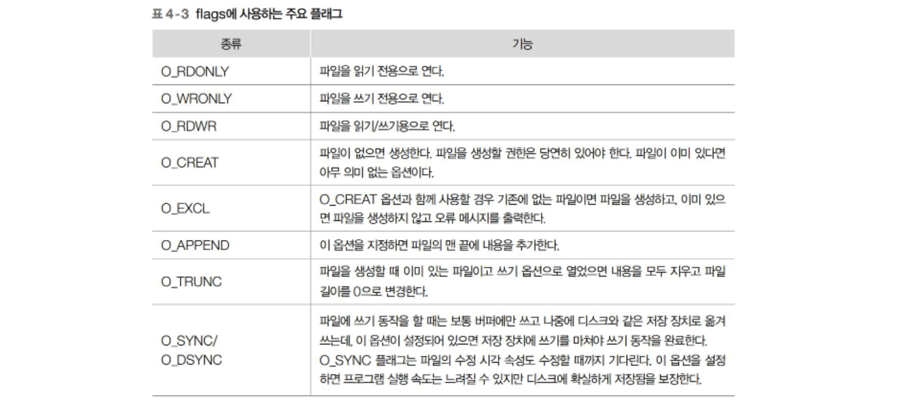

## ✅개요

파일은 관련 있는 데이터의 집합으로, 저장 장치에 일정한 형태로 저장됨.

- 일반 파일 : 텍스트나 바이너리 형태의 자료를 저장하는 파일
- 특수 파일 : 데이터 전송 또는 장치 접근에 사용하는 파일



## ✅저수준 파일 입출력

리눅스 커널의 시스템 호출을 이용해 파일 입출력을 수행

장점1 : 시스템 호출을 이용하므로 파일에 빠르게 접근할 수 있음.

장점2 : 바이트 단위로 파일의 내용을 다루므로 일반 파일 및 특수 파일도 읽고 쓰기 가능

*하지만 바이트 단위로 입출력 수행시 여러가지 기능을 함수로 추가 구현 해야함

### ➡️파일 열기 : open(2)

함수 원형 : int open(const char *pathname, int flags)

파일 기술자(fd) 리턴

### ➡️파일 생성 : creat(2)

함수 원형 : int creat(const char *pathname, mode_t mode);

파일 기술자(fd) 리턴

### ➡️파일 닫기 : close(2)

함수 원형 : int close(int fd);

성공시 0, 실패시 -1 리턴

예시(3개의 함수) :

```c
#include <sys/types.h>
#include <sys/stat.h>
#include <fcntl.h>
#include <unistd.h>
#include <stdlib.h>
#include <stdio.h>

int main() {
        int fd;
        mode_t mode;

        mode = S_IRUSR | S_IWUSR | S_IRGRP | S_IROTH;

        fd = open("test.txt", O_CREAT, mode);

        fd = open("test.txt", O_CREAT | O_EXCL, mode);
        if(fd==-1){
                perror("EXCL:");
        }
        fd = creat("test2.txt", mode);

        close(fd);
}
```

### ➡️파일 읽기 : read(2)

함수 원형 : ssize_t read(int fd, void *buf, size_t count);

예시 :

```c
#include <fcntl.h>
#include <unistd.h>
#include <stdlib.h>
#include <stdio.h>

int main() {
	int fd, nbyte;
	char buf[10];
	
	fd = open("linux.txt", O_RDONLY);
	if(fd == -1) {
		perror("OPEN");
		exit(1);
	}
	
	nbyte = read(fd, buf, sizeof(buf));
	if(nbyte == -1) {
		perror("READ");
		exit(1);
	}
	
	buf[nbyte] = 0;
	printf("nbyte = %d, buf = %s\n", nbyte, buf);
	close(fd);
}
```

### ➡️파일 쓰기 : write(2)

함수 원형 : ssize_t write(int fd, const void *buf, size_t count);

예시 :

```c
#include <fcntl.h>
#include <unistd.h>
#include <stdlib.h>
#include <stdio.h>

int main() {
	int rfd, wfd, nbyte;
	char buf[10];
	
	rfd = open("linux.txt", O_RDONLY);
	if(rfd == -1) {
		perror("open linux");
		exit(1);
	}
	
	wfd = open("linux.bak", O_CREAT|O_WRONLY|O_TRUNC, 0644);
	if(wfd == -1) {
		perror("open linux.bak");
		exit(1);
	}
	
	while((nbyte = read(rfd, buf, 5)) > 0) {
		if(write(wfd, buf, nbyte) != nbyte) perror("WRITE");
	}
	
	close(rfd);
	close(wfd);
}
```

### ➡️파일 오프셋 지정 : lseek(2)

함수 원형 : off_t lseek(int fd, off_t offset, int whence)

예시 :

```c
#include <fcntl.h>
#include <unistd.h>
#include <stdlib.h>
#include <stdio.h>

int main() {
        int fd, nbyte;
        off_t start, cur, end;
        char buf[256];

        fd = open("linux.txt", O_RDONLY);

        start = lseek(fd, 0, SEEK_CUR);
        nbyte = read(fd, buf, 255);
        buf[nbyte] = 0;
        printf("Offset start = %d, nbyte = %d, READ str = %s", (int)start, nbyte, buf);

        cur = lseek(fd, 0, SEEK_CUR);
        printf("Offset cur = %d\n", (int)cur);

        start = lseek(fd, 6, SEEK_SET);
        nbyte = read(fd, buf, 255);
        buf[nbyte] = 0;
        printf("Offset start = %d, nbyte = %d, READ str = %s", (int)start, nbyte, buf);

        end = lseek(fd, -5, SEEK_END); //끝 위치로부터 오프셋이 -5인 위치
        printf("SEEK_END -5 : %ld\n", end);
}
```

### ➡️파일 기술자 복사 : dup(2), **dup2(3)**

함수 원형 : int dup(int oldfd);

함수 원형 : int dup2(int oldfd, int newfd);

예시 :

```c
#include <fcntl.h>
#include <unistd.h>
#include <stdlib.h>
#include <stdio.h>

int main() {
	int fd, fd1;
	
	fd = open("tmp.bbb", O_CREAT | O_WRONLY | O_TRUNC, 0644);
	
	//가능한 파일 기술자를 부여
	fd1 = dup(fd);
	//지정한 파일 기술자를 부여(1번은 표준 출력(화면)인데, 이를 부여받았으므로 printf시 입력됨)
	dup2(fd, 1);
	printf("DUP2 : standard output redirection\n");
	
	close(fd);
	close(fd1);
}
```

### ➡️파일 기술자 제어 : fcntl(2)

함수 원형 : int fcntl(int fd, int cmd, … /*arg*/);

예시 :

```c
#include <sys/types.h>
#include <sys/stat.h>
#include <fcntl.h>
#include <unistd.h>
#include <stdlib.h>
#include <stdio.h>

int main() {
	int fd, flags;
	
	fd = open("linux.txt", O_RDWR);
	
	flags = fcntl(fd, F_GETFL);
	
	flags |= O_APPEND;
	
	fcntl(fd, F_SETFL, flags);
	
	write(fd, "Hanbit Academy\n", 15);
	
	close(fd);
}
```

### ➡️파일 삭제 : remove(3)

함수 원형 : int remove(const char *pathname);

예시 :

```c
#include <stdlib.h>
#include <stdio.h>

int main() {
	int ret;
	
	ret = remove("tmp.bbb");
	if(ret == -1){
		perror("remove fail");
		exit(1);
	}
	printf("remove success\n");
}
```

## ✅고수준 파일 입출력

C언어의 표준 함수를 이용해 문자 단위, 행 단위, 버퍼 단위, 형식 기반 입출력 가능

파일 포인터 : 디스크에서 메모리로 읽어온 파일의 위치에 관한 정보를 담고 있는 포인터

*FILE 구조체를 가리키는 주소로 이 구조체는 파일 기술자 항목을 포함하며, 기술자와 포인터 사이의 변환도 가능하다.

### ➡️파일 열기 : fopen(3)

함수 원형 : FILE **fopen(const char pathname, const char* *mode);

예시 :

```c
FILE *fp;
fp = fopen("test.txt", "r"); 
```

### ➡️파일 닫기 : fclose(3)

함수 원형 : int fclose(FILE *stream);

예시 :

```c
FILE *fp;
fp = fopen("test.txt", "w");
fclose(fp); //성공시 0, 실패시 -1 리턴
```

### ➡️문자 기반 입력 : fgetc(3), getc(), getchar(), getw(3)

함수 원형 : int fgetc(FILE *stream);

함수 원형 : int getc(FILE *stream); (fgetc의 매크로)

함수 원형 : int getchar(void); (getc(stdin)과 같음)

함수 원형 : int getw(FILE *stream); (워드 단위로 읽어온다. 워드의 크기는 int형의 크기)

### ➡️문자 기반 출력 : fputc(3), putc(), putchar(), putw(3)

함수 원형 : int fputc(int c, FILE *stream);

함수 원형 : int putc(int c, FILE *stream); (fputc의 매크로)

함수 원형 : int putchar(int c); (putchar(c, stdout)과 같음)

함수 원형 : int putw(int w, FILE *stream); (워드 단위로 출력)

- 문자 기반 입출력 예시 :

```c
#include <stdlib.h>
#include <stdio.h>

int main() {
	FILE *rfp, *wfp;
	int c;
	
	if((rfp = fopen("linux.txt", "r")) == NULL) {
		perror("fopen1");
		exit(1);
	}
	
	if((wfp = fopen("linux.out", "w")) == NULL) {
		perror("fopen2");
		exit(1);
	}
	//End Of File이 아닐 시 계속 문자 하나씩 정수형(아스키코드)으로 입력, 출력
	while((c = fgetc(rfp)) != EOF) {
		fputc(c, wfp);
	}
	
	fclose(rfp);
	fclose(wfp);
}
```

### ➡️문자열 기반 입력 : gets(3), fgets(3)

함수 원형 : char *gets(const char *s); (표준 입력에서 문자열 읽어들임, 문자열은 엔터키를 입력하거나, 파일의 끝을 만날 때까지)

함수 원형 : char *fgets(char *s, int size, FILE *stream);

→size에 지정한 길이보다 하나 적게 문자열을 읽어 s에 저장(개행문자나 널 문자도 저장함). 정상 입력 수행시 s의 시작 주소 리턴

### ➡️문자열 기반 출력 : puts(3), fputs(3)

함수 원형 : int puts(const char *s); (표준 출력으로 s가 가리키는 문자열 출력, 개행 문자를 추가해 출력한다.)

함수 원형 : int fputs(const char *s, FILE *stream);

→s가 가리키는 문자열을 파일 포인터가 가리키는 파일로 출력 (개행 문자 추가x)

- 문자열 기반 입출력 예시 :

```c
#include <stdlib.h>
#include <stdio.h>

int main() {
	FILE *rfp, *wfp;
	char buf[BUFSIZ];
	
	if((rfp = fopen("linux.txt", "r")) == NULL) {
		perror("fopen1");
		exit(1);
	}
	
	if((wfp = fopen("linux.out", "a")) == NULL) {
		perror("fopen2");
		exit(1);
	}
	//NULL인 경우는 파일이 비어있거나, 끝을 만났을 때
	while(fgets(buf, sizeof(buf), rfp) != NULL) {
		fputs(buf, wfp);
	}
	
	fclose(rfp);
	fclose(wfp);
}
```

### ➡️버퍼 기반 입력 : fread(3)

함수 원형 : size_t fread(void *ptr, size_t size, size_t nmemb, FILE *stream);

→ptr : 버퍼 주소, size : 버퍼 크기, nmemb : 읽어올 항목 수, stream : 파일 포인터

### ➡️버퍼 기반 출력 : fwrite(3)

함수 원형 : size_t fwrite(const void *ptr, size_t size, size_t nmemb, FILE *stream);

→ptr : 버퍼 주소, size : 항목 크기, nmemb : 항목 수, stream : 파일 포인터

- 버퍼 기반 입출력 예시 :

```c
#include <stdlib.h>
#include <stdio.h>

int main() {
	FILE *rfp, *wfp;
	char buf[BUFSIZ];
	int nbyte;
	
	if((rfp = fopen("linux.txt", "r")) == NULL) {
		perror("fopen1");
		exit(1);
	}
	
	if((wfp = fopen("linux.out", "a")) == NULL) {
		perror("fopen2");
		exit(1);
	}
	
	if((nbyte = fread(buf, 1, sizeof(buf), rfp)) > 0) {
		fwrite(buf, 1, nbyte, wfp);
	}
	
	fclose(rfp);
	fclose(wfp);
}
```

### ➡️형식 기반 입력 : scanf(3), fscanf(3)

함수 원형 : int scanf(const char *format);

함수 원형 : int fscanf(FILE *stream, const char *format, …);

### ➡️형식 기반 출력 : printf(3), fprintf(3)

함수 원형 : int printf(const char *format, …);

함수 원형 : int fprintf(FILE *stream, const char *format, …);*

### ➡️파일 오프셋 이동, 현재 위치 구하기, 처음 위치로 : fseek(3), ftell(3), rewind(3)

함수 원형 : int fseek(FILE *stream, long offset, int whence);

함수 원형 : long ftell(FILE *stream); (cur = fseek(fp, 0, SEEK_CUR) 금지!)

함수 원형 : void rewind(FILE *stream);

## ✅ 파일 기술자와 파일 포인터 변환

### ➡️파일 기술자 → 파일 포인터 : fdopen(3)

FILE *fdopen(int fd, const char *mode);

→mode는 “r”과 같은 고수준 형식이며, 파일 기술자 flag와 동일하게 지정해야함

### ➡️파일 포인터 → 파일 기술자 : fileno(3)

int fileno(FILE *stream);