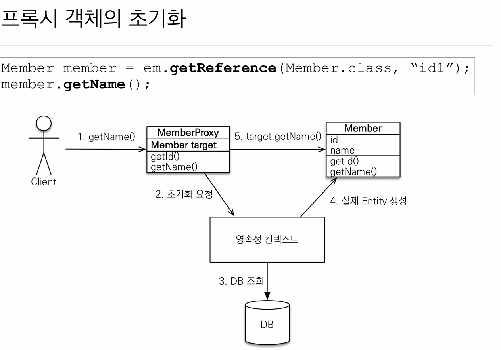

## 프록시

### 프록시 객체의 초기화



### 프록시의 특징

- 프록시 객체는 처음 사용할 때 한 번만 초기화
    - 프록시 객체를 초기화 할 때, **프록시 객체가 실제 엔티티로 바뀌는 것은 아님**, 초
      기화되면 프록시 객체를 통해서 실제 엔티티에 접근이 가능해지는 것

- 프록시 객체는 원본 엔티티를 상속받음, 따라서 타입 체크시 주의해야함 **(== 비
  교 실패, 대신 instance of 사용)**

- **영속성 컨텍스트에 찾는 엔티티가 이미 있으면 em.getReference()를 호출해
  도 실제 엔티티 반환**
    - 영속성 컨텍스트의 도움을 받을 수 없는 준영속 상태일 때, 프록시를 초기화하면
      문제 발생
      (하이버네이트는 org.hibernate.LazyInitializationException 예외를 터트림

---

## N + 1 문제 해결 방법

> 최초로 select 쿼리가 1개 나가고, 나오는 행만큼 N개의 쿼리가 나가는 문제 발생(EAGER 로딩 시에)
>

ManyToOne, OneToOne은 기본이 즉시 로딩이므로 변경 필요(OneToMany는 지연로딩)

💡가장 중요한 포인트는 모두 LAZY 로딩으로 적용 후에 필요한 경우에 join 적용시키기

1. fetch join

```sql
select m from Member m join fetch m.team
```

실행 시점에 원하는 경우 동적으로 끌고 오는 것이 가능

---

## 영속성 전이: CASCADE

> JPA에서는 특정 엔티티를 영속 상태로 만들  연관된 엔티티도 함께 영속 상태로 만들고 싶을 때 사용하는 것
>

영속성 전이는 연관관계 매핑과 아~무 관련이 없음(영속화할 때 연관된 엔티티도 함께 영속화하는 편리함만 제공)

## 고아 객체: orphanRemoval = true

> 부모 엔티티와 연관관계가 끊어진 자식 엔티티를 자동으로 삭제(delete 쿼리 나감)
>

참조가 제거된 엔티티는 다른 곳에서 참조하지 않는 객체로 판단하여 삭제

**‼️참조하는 곳이 하나일 때만 사용해야함**

➡️ **두 옵션을 모두 활성화 하면 부모 엔티티의 생명 주기 관리를 통해 자식의 생명 주기를 통제 가능**

---

## 값 타입

값 타입 객체를 변경할 경우 객체 자체를 갈아 끼워야함(setter 금지)

기본적인 값 타입 String, Integer 등은 모두 불변 객체